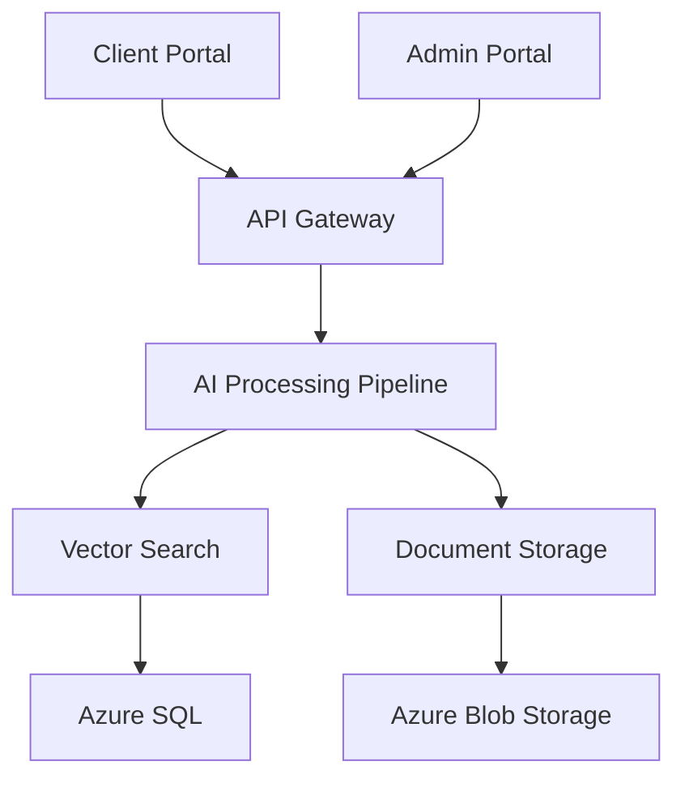

# AI-powered Product Catalog Search System

[](https://github.com/org/repo/actions/workflows/main.yml)
[](https://codecov.io/gh/org/repo)
[](LICENSE)

An enterprise-grade AI-powered search and retrieval system for technical product catalogs, leveraging GPT-4, NVidia OCR, and LLamaindex technologies to provide intelligent document processing and natural language querying capabilities.

## Project Overview

The AI-powered Product Catalog Search System is a transformative solution that automates the extraction, processing, and retrieval of product information from complex technical documentation. Built on a multi-tenant Azure cloud infrastructure, the system offers:

- Advanced document processing with NVidia OCR and GPT-4
- Intelligent vector-based search powered by LLamaindex
- Dual-portal system with dedicated admin and client interfaces
- Enterprise-grade security and compliance standards
- High-performance architecture with 99.9% uptime SLA
- Multi-region deployment support for global availability

### System Architecture



## Prerequisites

### System Requirements

- Python 3.11+ with pip and virtualenv
- Node.js 18+ with npm
- Docker 24+ with Compose V2
- Azure CLI 2.50+
- Kubernetes CLI 1.28+
- NVIDIA GPU drivers 525.105.17+
- CUDA Toolkit 11.8+

### Hardware Requirements

- Minimum 32GB RAM
- 100GB available storage
- NVIDIA GPU for optimal OCR processing
- Azure subscription with required permissions

## Quick Start

1. **Clone the Repository**
   ```bash
   git clone https://github.com/org/repo.git
   cd repo
   ```

2. **Set Up Development Environment**
   ```bash
   # Backend setup
   python -m venv venv
   source venv/bin/activate  # or `venv\Scripts\activate` on Windows
   pip install -r requirements.txt

   # Frontend setup
   cd src/web
   npm install
   ```

3. **Configure Environment**
   ```bash
   cp .env.example .env
   # Edit .env with your configuration
   ```

4. **Launch Development Server**
   ```bash
   # Start backend
   python src/backend/main.py

   # Start frontend
   cd src/web
   npm run dev
   ```

5. **Verify Installation**
   ```bash
   # Run test suite
   pytest
   npm test

   # Process sample data
   python scripts/ingest_sample_data.py
   ```

## Development

### Backend Development

- FastAPI-based REST API
- Async processing pipeline
- Vector search implementation
- Document processing services
- Authentication and authorization

### Frontend Development

- React-based portals (Admin/Client)
- Material-UI components
- Redux state management
- Real-time updates
- Responsive design

### Infrastructure

- Terraform configurations
- Kubernetes manifests
- Azure resource templates
- Monitoring setup
- Security configurations

## Deployment

### Environment Setup

1. **Development**
   - Local development environment
   - Docker-based services
   - Mock external services
   - Debug configurations

2. **Staging**
   - AKS cluster deployment
   - Integration testing
   - Performance testing
   - Security scanning

3. **Production**
   - Multi-region deployment
   - High availability setup
   - Disaster recovery
   - Monitoring and alerts

### Deployment Process

```bash
# Deploy infrastructure
cd infrastructure/terraform
terraform init
terraform apply

# Deploy application
kubectl apply -f infrastructure/kubernetes/
```

## Documentation

- [API Documentation](docs/api/README.md)
- [Architecture Guide](docs/architecture/README.md)
- [User Guide](docs/user/README.md)
- [Development Guide](docs/development/README.md)
- [Security Guide](docs/security/README.md)
- [Operations Guide](docs/operations/README.md)

## Repository Structure

```
.
├── src/
│   ├── backend/          # Python backend services
│   └── web/             # React frontend applications
├── infrastructure/
│   ├── terraform/       # Infrastructure as Code
│   └── kubernetes/      # K8s configurations
├── .github/
│   └── workflows/       # CI/CD pipelines
└── docs/               # Documentation
```

## Contributing

Please read [CONTRIBUTING.md](CONTRIBUTING.md) for details on our code of conduct and the process for submitting pull requests.

## License

This project is licensed under the MIT License - see the [LICENSE](LICENSE) file for details.

## Maintainers

- Lead Developer (lead@example.com)
- System Architect (architect@example.com)

---
Last updated: 2024-01-20