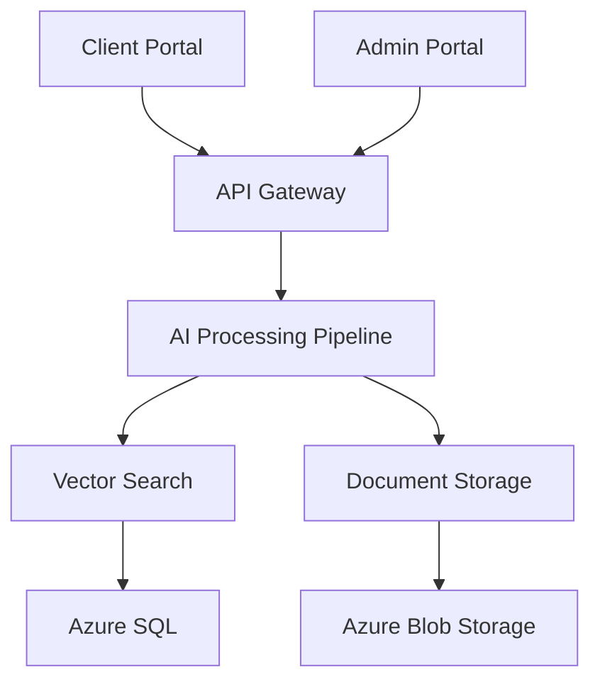

# AI-powered Product Catalog Search System

[](https://github.com/org/repo/actions/workflows/main.yml)
[](https://codecov.io/gh/org/repo)
[](LICENSE)

An enterprise-grade AI-powered search and retrieval system for technical product catalogs, leveraging GPT-4, NVidia OCR, and LLamaindex technologies to provide intelligent document processing and natural language querying capabilities.

## Project Overview

The AI-powered Product Catalog Search System is a transformative solution that automates the extraction, processing, and retrieval of product information from complex technical documentation. Built on a multi-tenant Azure cloud infrastructure, the system features:

- Advanced AI processing pipeline with GPT-4 and NVidia OCR
- Vector-based semantic search powered by LLamaindex
- Dual-portal architecture with React-based admin and client interfaces
- Enterprise-grade security with multi-tenant isolation
- Comprehensive audit logging and analytics

### Performance Benchmarks

- Search time reduction: 80% compared to manual searching
- Information accuracy: >95% in returned results
- System availability: 99.9% uptime
- Query response time: <1 minute
- User satisfaction rate: 90% within 3 months

### System Architecture



## Prerequisites

### System Requirements

- Python 3.11+ with pip and virtualenv
- Node.js 18+ with npm
- Docker 24+ with Compose V2
- Azure CLI 2.50+
- Kubernetes CLI 1.28+
- NVIDIA GPU drivers 525.105.17+
- CUDA Toolkit 11.8+

### Hardware Requirements

- Minimum 32GB RAM
- 100GB available storage
- NVIDIA GPU for OCR processing
- High-speed internet connection

### Cloud Requirements

- Azure subscription with required permissions
- Sufficient quota for required services
- Access to Azure Kubernetes Service (AKS)
- Azure AD B2C tenant for authentication

## Quick Start

1. **Clone the Repository**
   ```bash
   git clone https://github.com/org/repo.git
   cd repo
   ```

2. **Set Up Development Environment**
   ```bash
   # Backend setup
   python -m venv venv
   source venv/bin/activate  # or `venv\Scripts\activate` on Windows
   pip install -r requirements.txt

   # Frontend setup
   cd src/web
   npm install
   ```

3. **Configure Environment**
   ```bash
   cp .env.example .env
   # Edit .env with your configuration
   ```

4. **Start Development Servers**
   ```bash
   # Start backend
   python src/backend/main.py

   # Start frontend
   cd src/web
   npm run dev
   ```

5. **Verify Installation**
   ```bash
   # Run test suite
   pytest
   npm test

   # Verify services
   curl http://localhost:8000/health
   ```

## Development

### Backend Development

- Follow PEP 8 style guide
- Implement type hints
- Write unit tests for new features
- Document API endpoints using OpenAPI
- Use async/await for I/O operations

### Frontend Development

- Follow React best practices
- Use TypeScript for type safety
- Implement component tests
- Follow Material-UI guidelines
- Optimize for performance

### Infrastructure Development

- Use Infrastructure as Code (Terraform)
- Follow GitOps principles
- Implement monitoring and logging
- Configure auto-scaling
- Set up disaster recovery

## Deployment

### Development Environment

```bash
terraform init
terraform plan -var-file=dev.tfvars
terraform apply -var-file=dev.tfvars
```

### Production Environment

```bash
# Deploy to production
./deploy.sh production

# Verify deployment
kubectl get pods -n production
```

### Multi-region Setup

- Primary region: East US
- Secondary region: West Europe
- Data replication configuration
- Traffic manager setup
- Failover procedures

## Documentation

### API Documentation

- OpenAPI specification: `/docs/api/openapi.yaml`
- Swagger UI: `http://localhost:8000/docs`
- API versioning guidelines
- Authentication flows
- Rate limiting policies

### User Guides

- Admin Portal Guide: `/docs/admin-guide.md`
- Client Portal Guide: `/docs/client-guide.md`
- Integration Guide: `/docs/integration-guide.md`
- Security Guide: `/docs/security-guide.md`

### Architecture

- System design documents
- Data flow diagrams
- Security architecture
- Scaling strategies
- Disaster recovery plans

## Repository Structure

```
├── src/
│   ├── backend/          # Python FastAPI application
│   ├── web/             # React frontend applications
│   └── ai/              # AI processing modules
├── infrastructure/
│   ├── terraform/       # IaC configurations
│   └── kubernetes/      # K8s manifests
├── docs/                # Documentation
└── .github/             # GitHub workflows
```

## Contributing

Please read [CONTRIBUTING.md](CONTRIBUTING.md) for details on our code of conduct and the process for submitting pull requests.

## License

This project is licensed under the MIT License - see the [LICENSE](LICENSE) file for details.

## Maintainers

- Lead Developer (lead@example.com)
- System Architect (architect@example.com)

---
Last updated: 2024-01-20