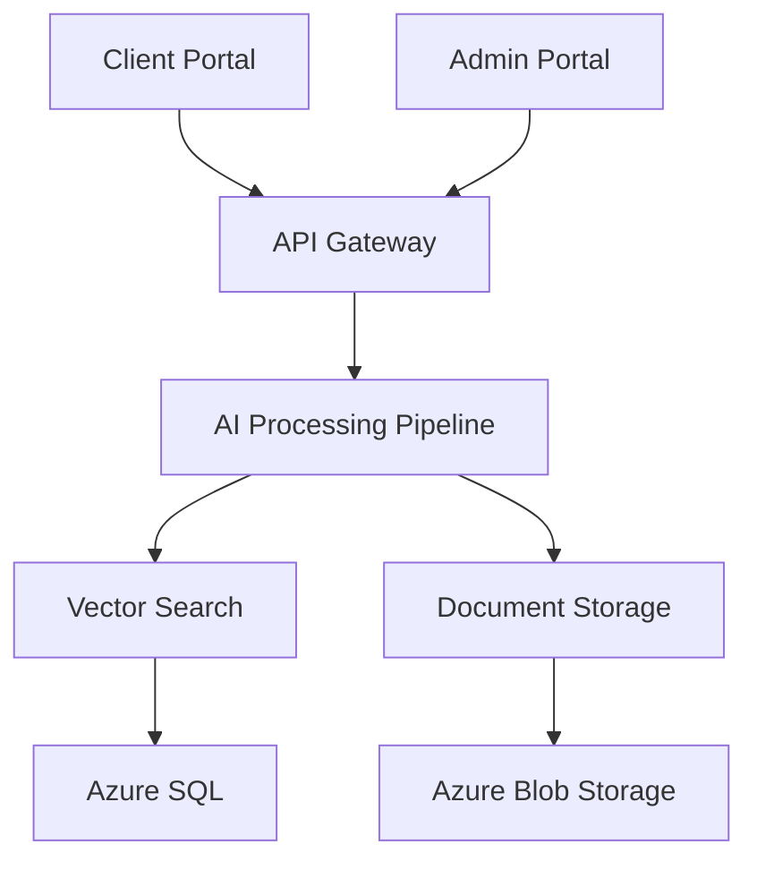

# AI-powered Product Catalog Search System

[](https://github.com/org/repo/actions/workflows/main.yml)
[](https://codecov.io/gh/org/repo)
[](LICENSE)

## Project Overview

The AI-powered Product Catalog Search System is an enterprise-grade solution that revolutionizes technical product information retrieval through advanced AI technologies. The system leverages GPT-4, NVidia OCR, and LLamaindex to provide intelligent search capabilities across complex technical documentation.

### Key Features

- **Advanced AI Processing**: Utilizes GPT-4 for natural language understanding and NVidia OCR for document processing
- **Vector Search**: Implements LLamaindex for high-performance similarity search and retrieval
- **Multi-tenant Architecture**: Secure data isolation with Azure cloud infrastructure
- **Dual Portal System**: Separate admin and client interfaces built with React
- **Enterprise Security**: Comprehensive security features with SOC 2 Type II compliance
- **High Performance**: 99.9% uptime with sub-minute query responses

### System Architecture



## Prerequisites

### System Requirements

- Python 3.11+ with pip and virtualenv
- Node.js 18+ with npm
- Docker 24+ with Compose V2
- Azure CLI 2.50+
- Kubernetes CLI 1.28+
- NVIDIA GPU drivers 525.105.17+
- CUDA Toolkit 11.8+

### Hardware Requirements

- Minimum 32GB RAM
- 100GB available storage
- NVIDIA GPU (for OCR processing)
- High-speed internet connection

### Cloud Requirements

- Azure subscription with required permissions
- Sufficient quota for required services
- Access to Azure Kubernetes Service (AKS)

## Quick Start

1. **Clone the Repository**
   ```bash
   git clone https://github.com/org/repo.git
   cd repo
   ```

2. **Set Up Development Environment**
   ```bash
   # Backend setup
   python -m venv venv
   source venv/bin/activate  # or `venv\Scripts\activate` on Windows
   pip install -r requirements.txt

   # Frontend setup
   cd src/web
   npm install
   ```

3. **Configure Environment**
   ```bash
   cp .env.example .env
   # Edit .env with your configuration
   ```

4. **Start Development Servers**
   ```bash
   # Backend
   python src/backend/main.py

   # Frontend
   cd src/web
   npm run dev
   ```

5. **Verify Installation**
   ```bash
   # Run test suite
   pytest
   npm test

   # Verify services
   curl http://localhost:8000/health
   ```

## Development

### Backend Development

- Follow [PEP 8](https://pep8.org/) style guide
- Implement comprehensive test coverage
- Use FastAPI for API development
- Document all endpoints with OpenAPI

### Frontend Development

- Follow React best practices
- Implement component-based architecture
- Use TypeScript for type safety
- Follow Material-UI design system

### Infrastructure Development

- Use Infrastructure as Code (Terraform)
- Follow GitOps principles
- Implement automated testing
- Maintain deployment documentation

## Deployment

### Development Environment

```bash
terraform init
terraform plan -var-file=dev.tfvars
terraform apply -var-file=dev.tfvars
```

### Production Environment

```bash
# Deploy to production
./deploy.sh production

# Verify deployment
kubectl get pods -n production
```

### Multi-region Setup

- Primary Region: Azure East US
- Secondary Region: Azure West US
- Database: Geo-replicated
- Storage: Zone-redundant

## Documentation

### API Documentation

- OpenAPI documentation available at `/docs`
- Swagger UI for interactive testing
- Comprehensive endpoint descriptions
- Authentication details

### User Guides

- [Admin Portal Guide](docs/admin-guide.md)
- [Client Portal Guide](docs/client-guide.md)
- [API Integration Guide](docs/api-guide.md)
- [Troubleshooting Guide](docs/troubleshooting.md)

## Contributing

Please read [CONTRIBUTING.md](CONTRIBUTING.md) for details on our code of conduct and the process for submitting pull requests.

## Security

- Report security vulnerabilities to security@example.com
- Follow security best practices in [SECURITY.md](SECURITY.md)
- Regular security audits and penetration testing
- Compliance with GDPR and SOC 2 Type II

## License

This project is licensed under the MIT License - see the [LICENSE](LICENSE) file for details.

## Maintainers

- Lead Developer (lead@example.com)
- System Architect (architect@example.com)

---
Last updated: 2024-01-20