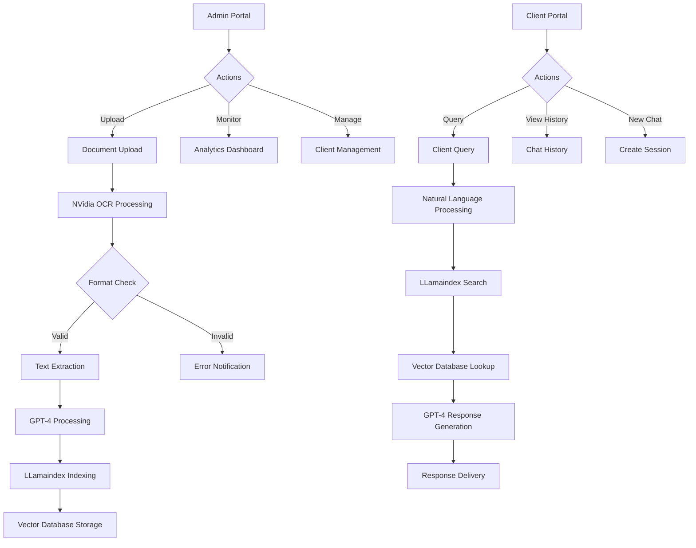
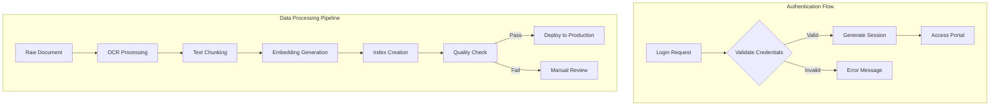
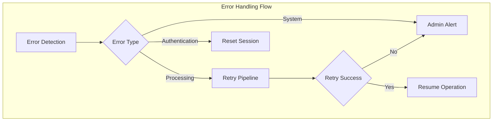
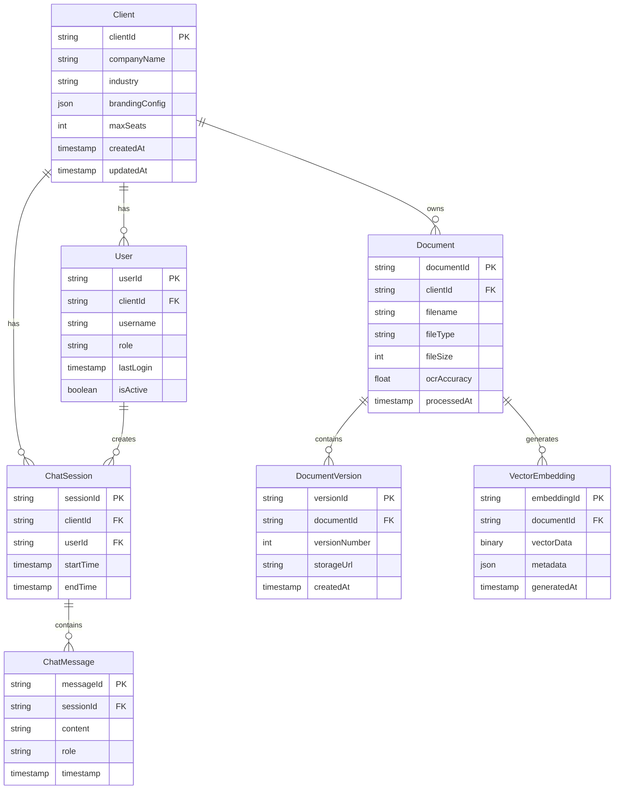
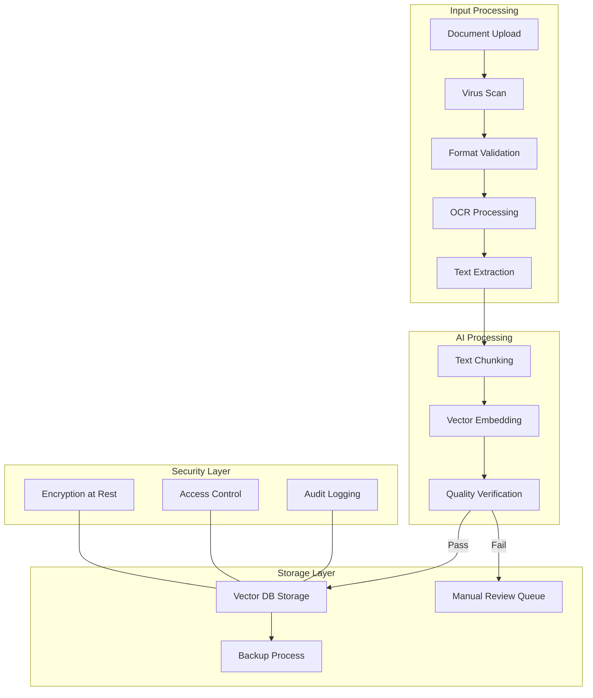

# Product Requirements Document (PRD)

# 1. INTRODUCTION

## 1.1 Purpose

This Software Requirements Specification (SRS) document provides a comprehensive description of the AI-powered Product Catalog Search System. It details the functional and non-functional requirements for development teams, project stakeholders, and quality assurance teams to ensure aligned understanding and successful implementation of the system.

## 1.2 Scope

The AI-powered Product Catalog Search System is a web-based application designed to transform how organizations access and utilize product information from technical documentation. The system encompasses:

- A dual-portal architecture (admin and client interfaces)
- AI-powered document processing pipeline using NVidia OCR and GPT-4
- Natural language query processing using LLamaindex
- Secure multi-tenant data management
- RESTful API infrastructure
- React-based user interfaces

Key benefits include:

- Reduced manual search time for product information
- Improved accuracy in information retrieval
- Scalable document processing capabilities
- Secure and segregated client data management
- Customizable client portals with branding options

Core functionalities:

- Document ingestion and processing (PDF, Word, Excel)
- Natural language query interface
- Client account management
- Usage analytics and reporting
- Brand customization options
- Secure document storage and retrieval

The system will be hosted on Azure infrastructure, ensuring high availability and scalability for enterprise use.

# 2. PRODUCT DESCRIPTION

## 2.1 Product Perspective

The AI-powered Product Catalog Search System operates as a standalone web application within an enterprise technology ecosystem. The system interfaces with:

- Azure Cloud Infrastructure for hosting and scalability
- Client authentication systems via SSO integration
- Enterprise document management systems
- External AI services (GPT-4, NVidia OCR)
- Client branding and customization systems

System Architecture Components:

| Component | Description |
| --- | --- |
| Frontend Layer | React-based admin and client portals |
| API Layer | RESTful services for data access and integration |
| Processing Layer | NVidia OCR and GPT-4 document processing pipeline |
| Storage Layer | Secure multi-tenant database architecture |
| AI Layer | LLamaindex-powered query processing and response generation |

## 2.2 Product Functions

Core System Functions:

1. Document Management

   - Catalog ingestion (PDF, Word, Excel)
   - OCR processing and text extraction
   - Document versioning and replacement
   - Secure storage and retrieval

2. AI-Powered Search

   - Natural language query processing
   - Context-aware response generation
   - Multi-document knowledge synthesis
   - Accuracy verification and testing

3. Account Administration

   - Client account provisioning
   - Usage monitoring and analytics
   - Portal customization and branding
   - Access control management

4. Client Interaction

   - Chat-based query interface
   - Conversation management
   - Chat history tracking
   - Multiple concurrent sessions

## 2.3 User Characteristics

Primary User Types:

1. System Administrators

   - Technical expertise: High
   - System knowledge: Advanced
   - Responsibilities: Client management, system configuration, catalog processing
   - Frequency of use: Daily

2. Industrial Sales Engineers

   - Technical expertise: Medium to High
   - System knowledge: Basic to Intermediate
   - Responsibilities: Product information retrieval, technical queries
   - Frequency of use: Regular

3. Technical Service Professionals

   - Technical expertise: Medium
   - System knowledge: Basic
   - Responsibilities: Product support, troubleshooting
   - Frequency of use: Frequent

4. New Employees

   - Technical expertise: Low to Medium
   - System knowledge: Basic
   - Responsibilities: Learning products and specifications
   - Frequency of use: Intensive during onboarding

## 2.4 Constraints

1. Technical Constraints

   - Maximum document processing time: 3 hours
   - Minimum OCR accuracy: 95%
   - Required system uptime: 99.9%
   - Azure infrastructure limitations
   - API rate limits for external services

2. Security Constraints

   - Data encryption requirements
   - Multi-tenant data isolation
   - Compliance with data protection regulations
   - Authentication and authorization protocols

3. Performance Constraints

   - Maximum query response time: 1 minute
   - Concurrent user session limits
   - Storage capacity limitations
   - Network bandwidth requirements

## 2.5 Assumptions and Dependencies

Assumptions:

1. Input documents will be in supported formats (PDF, Word, Excel)
2. Clients have stable internet connectivity
3. Users have modern web browsers
4. Source documents contain accurate information
5. Client branding assets will be provided in standard formats

Dependencies:

1. External Services

   - GPT-4 API availability
   - NVidia OCR service stability
   - Azure cloud services
   - LLamaindex framework updates

2. Infrastructure

   - Network connectivity
   - Database performance
   - Storage capacity
   - Processing power allocation

3. Client Resources

   - Document quality
   - Branding guidelines
   - User training availability
   - Technical support capability

# 3. PROCESS FLOWCHART







# 4. FUNCTIONAL REQUIREMENTS

## 4.1 Document Management Features

| ID | Description | Priority |
| --- | --- | --- |
| DOC-001 | Upload multiple document formats (PDF, Word, Excel) with size limit of 100MB per file | HIGH |
| DOC-002 | NVidia OCR processing with 95%+ accuracy for text extraction | HIGH |
| DOC-003 | Document versioning system with replacement and rollback capabilities | MEDIUM |
| DOC-004 | Automatic document validation and error reporting | HIGH |
| DOC-005 | Bulk document upload with progress tracking | MEDIUM |
| DOC-006 | Document metadata management and tagging | LOW |

## 4.2 AI Processing Features

| ID | Description | Priority |
| --- | --- | --- |
| AI-001 | GPT-4 powered text analysis and structuring | HIGH |
| AI-002 | LLamaindex vector database creation and management | HIGH |
| AI-003 | Natural language query processing with context awareness | HIGH |
| AI-004 | Multi-document knowledge synthesis | HIGH |
| AI-005 | Response accuracy verification system | MEDIUM |
| AI-006 | Automated retraining pipeline for improved accuracy | LOW |

## 4.3 Admin Portal Features

| ID | Description | Priority |
| --- | --- | --- |
| ADM-001 | Client account creation and management | HIGH |
| ADM-002 | Document processing pipeline monitoring | HIGH |
| ADM-003 | Usage analytics and reporting dashboard | MEDIUM |
| ADM-004 | Client portal branding customization | MEDIUM |
| ADM-005 | System-wide configuration management | HIGH |
| ADM-006 | Batch operations for client management | LOW |

## 4.4 Client Portal Features

| ID | Description | Priority |
| --- | --- | --- |
| CLI-001 | Natural language chat interface | HIGH |
| CLI-002 | Chat history management and search | HIGH |
| CLI-003 | Multiple concurrent chat sessions | MEDIUM |
| CLI-004 | Response feedback mechanism | MEDIUM |
| CLI-005 | Customizable chat interface with branding | MEDIUM |
| CLI-006 | Export chat history functionality | LOW |

## 4.5 Security Features

| ID | Description | Priority |
| --- | --- | --- |
| SEC-001 | Multi-tenant data isolation | HIGH |
| SEC-002 | Role-based access control | HIGH |
| SEC-003 | Audit logging system | HIGH |
| SEC-004 | Data encryption at rest and in transit | HIGH |
| SEC-005 | Session management and timeout controls | MEDIUM |
| SEC-006 | API rate limiting and throttling | MEDIUM |

## 4.6 Integration Features

| ID | Description | Priority |
| --- | --- | --- |
| INT-001 | RESTful API endpoints for all core functions | HIGH |
| INT-002 | SSO integration capabilities | MEDIUM |
| INT-003 | Webhook system for event notifications | MEDIUM |
| INT-004 | External system data synchronization | LOW |
| INT-005 | Custom API key management | MEDIUM |
| INT-006 | API usage monitoring and analytics | LOW |

# 5. NON-FUNCTIONAL REQUIREMENTS

## 5.1 Performance Requirements

| Metric | Requirement |
| --- | --- |
| Query Response Time | \< 60 seconds for natural language queries |
| Document Processing Time | \< 3 hours for catalog ingestion and processing |
| OCR Processing Accuracy | ≥ 95% accuracy rate |
| Concurrent Users | Support minimum 1000 simultaneous users |
| API Response Time | \< 500ms for 95% of API requests |
| Database Query Time | \< 100ms for 90% of database operations |
| Maximum File Size | 1GB per document upload |
| Memory Usage | \< 4GB per user session |
| Bandwidth | Support minimum 100Mbps network throughput |

## 5.2 Safety Requirements

| Category | Requirement |
| --- | --- |
| Data Backup | Automated daily backups with 30-day retention |
| Disaster Recovery | Recovery Time Objective (RTO) \< 4 hours |
| System Monitoring | Real-time monitoring with automated alerts |
| Failover | Automatic failover to secondary systems |
| Data Loss Prevention | Recovery Point Objective (RPO) \< 15 minutes |
| Error Handling | Graceful degradation of services during failures |
| Session Management | Automatic session termination after 30 minutes of inactivity |
| Version Control | Document version history maintained for 90 days |

## 5.3 Security Requirements

| Category | Requirement |
| --- | --- |
| Authentication | - Multi-factor authentication support<br>- SSO integration capability<br>- Password complexity enforcement |
| Authorization | - Role-based access control (RBAC)<br>- Granular permission management<br>- JWT-based API authentication |
| Data Protection | - AES-256 encryption for data at rest<br>- TLS 1.3 for data in transit<br>- Multi-tenant data isolation |
| Audit | - Comprehensive audit logging<br>- User activity tracking<br>- Security event monitoring |
| API Security | - Rate limiting: 1000 requests per hour per client<br>- API key rotation every 90 days<br>- Request validation and sanitization |
| Compliance | - GDPR compliance for EU clients<br>- SOC 2 Type II certification<br>- ISO 27001 compliance |

## 5.4 Quality Requirements

### 5.4.1 Availability

- System uptime: 99.9% (excluding planned maintenance)
- Planned maintenance windows: \< 4 hours monthly
- Service degradation: \< 0.1% of total operation time

### 5.4.2 Maintainability

- Code documentation coverage: \> 80%
- Automated test coverage: \> 85%
- Maximum resolution time for critical issues: \< 4 hours
- Regular system updates: Monthly schedule

### 5.4.3 Usability

- Learning curve: \< 2 hours for basic operations
- Error messages: Clear, actionable, and user-friendly
- Mobile responsiveness: Support for all modern devices
- Accessibility: WCAG 2.1 Level AA compliance

### 5.4.4 Scalability

- Horizontal scaling: Support for 100% increase in load within 10 minutes
- Storage scaling: Automatic expansion up to 1TB per client
- Processing capacity: Linear scaling with added resources
- Database performance: Maintain response times up to 10M records

### 5.4.5 Reliability

- Mean Time Between Failures (MTBF): \> 720 hours
- Mean Time To Repair (MTTR): \< 2 hours
- Error rate: \< 0.1% for all transactions
- Data accuracy: \> 99.9% for processed information

## 5.5 Compliance Requirements

| Requirement Type | Specification |
| --- | --- |
| Data Protection | - GDPR compliance<br>- CCPA compliance<br>- Data residency requirements |
| Industry Standards | - ISO 27001:2013<br>- SOC 2 Type II<br>- NIST Cybersecurity Framework |
| API Standards | - OpenAPI 3.0 specification<br>- REST architectural constraints<br>- OAuth 2.0 authentication |
| Documentation | - API documentation in OpenAPI format<br>- Technical documentation in Markdown<br>- Compliance documentation maintenance |
| Accessibility | - WCAG 2.1 Level AA<br>- Section 508 compliance<br>- ADA compliance |
| Audit Requirements | - Annual security audits<br>- Quarterly compliance reviews<br>- Monthly security assessments |

# 6. DATA REQUIREMENTS

## 6.1 Data Models



## 6.2 Data Storage

### 6.2.1 Storage Requirements

| Data Type | Storage System | Retention Period | Backup Frequency |
| --- | --- | --- | --- |
| Client Data | Azure SQL Database | Indefinite | Daily |
| Document Files | Azure Blob Storage | Contract Duration + 1 year | Daily |
| Vector Embeddings | Azure Cosmos DB | Same as source document | Weekly |
| Chat History | Azure SQL Database | 90 days | Daily |
| System Logs | Azure Monitor | 30 days | Daily |
| Audit Trails | Azure SQL Database | 1 year | Daily |

### 6.2.2 Redundancy Configuration

| Component | Redundancy Strategy |
| --- | --- |
| Primary Database | Active geo-replication with 3 secondary replicas |
| Blob Storage | Zone-redundant storage (ZRS) with cross-region backup |
| Vector Database | Multi-region deployment with automatic failover |
| Application Data | Read-replicas in each deployment region |

### 6.2.3 Backup and Recovery

| Aspect | Specification |
| --- | --- |
| Backup Schedule | Daily incremental, Weekly full |
| Retention Policy | 30 days rolling backup |
| Recovery Time Objective | \< 4 hours |
| Recovery Point Objective | \< 15 minutes |
| Backup Encryption | AES-256 encryption |
| Recovery Testing | Monthly automated recovery tests |

## 6.3 Data Processing



### 6.3.1 Data Security Controls

| Security Layer | Implementation |
| --- | --- |
| Encryption | - TLS 1.3 for transit<br>- AES-256 for storage<br>- Key rotation every 90 days |
| Access Control | - Row-level security<br>- Column-level encryption<br>- Client data isolation |
| Monitoring | - Real-time threat detection<br>- Anomaly detection<br>- Access pattern analysis |
| Compliance | - GDPR data handling<br>- SOC 2 controls<br>- Data residency enforcement |

### 6.3.2 Data Processing Requirements

| Process Type | Requirements |
| --- | --- |
| Document Ingestion | - Max file size: 1GB<br>- Supported formats: PDF, Word, Excel<br>- OCR accuracy threshold: 95% |
| Vector Processing | - Chunk size: 1000 tokens<br>- Overlap: 100 tokens<br>- Embedding dimension: 1536 |
| Query Processing | - Max query length: 1000 characters<br>- Response time: \< 60 seconds<br>- Context window: 8192 tokens |
| Batch Processing | - Max batch size: 1000 documents<br>- Concurrent processing: 10 documents<br>- Queue timeout: 24 hours |

# 7. EXTERNAL INTERFACES

## 7.1 User Interfaces

### 7.1.1 Admin Portal Interface

| Component | Requirements |
| --- | --- |
| Dashboard | - Material Design components<br>- Responsive grid layout<br>- Real-time status indicators<br>- Interactive data visualizations |
| Client Management | - Tabular client listing with sorting/filtering<br>- Modal forms for client operations<br>- Drag-and-drop document upload<br>- Progress indicators for processing |
| Analytics | - Chart.js visualizations<br>- Exportable reports<br>- Date range selectors<br>- Metric cards |
| Settings | - Form-based configuration<br>- Toggle switches for features<br>- Role permission matrix<br>- Branding customization tools |

### 7.1.2 Client Portal Interface

| Component | Requirements |
| --- | --- |
| Chat Interface | - Bubble-style message layout<br>- Markdown support for responses<br>- Real-time typing indicators<br>- Message timestamp display |
| Navigation | - Sidebar chat history<br>- Search functionality<br>- Session management tabs<br>- Responsive mobile design |

\[UI Mockup Placeholders - To be provided by design team\]

## 7.2 Hardware Interfaces

| Interface | Specification |
| --- | --- |
| Storage Systems | - Azure Blob Storage API v12<br>- Azure Disk Storage interface<br>- NVMe SSD for vector operations |
| Processing Units | - NVIDIA T4 GPU interface for OCR<br>- CPU allocation for API processing<br>- Memory management interface |
| Network Hardware | - 10Gbps network interface<br>- Load balancer integration<br>- Network security groups |

## 7.3 Software Interfaces

| System | Interface Specifications |
| --- | --- |
| Azure Services | - Azure SDK v12.0+<br>- Azure Identity client<br>- Azure Key Vault integration<br>- Azure Monitor client |
| AI Services | - GPT-4 API v1.0<br>- NVIDIA OCR SDK<br>- LLamaindex v0.8+<br>- Vector store connectors |
| Database Systems | - Azure SQL Database client<br>- Cosmos DB SDK<br>- Redis Cache interface<br>- Entity Framework Core 7.0 |
| External Systems | - REST API endpoints<br>- OAuth 2.0 integration<br>- SMTP email service<br>- SSO provider interfaces |

## 7.4 Communication Interfaces

### 7.4.1 Network Protocols

| Protocol | Specification |
| --- | --- |
| HTTP/HTTPS | - TLS 1.3 required<br>- REST API endpoints<br>- WebSocket connections<br>- HTTP/2 support |
| Database | - TCP/IP connections<br>- Connection pooling<br>- Encrypted channels<br>- Keep-alive settings |
| Caching | - Redis protocol<br>- In-memory caching<br>- Distributed cache sync |

### 7.4.2 Data Formats

| Format | Usage |
| --- | --- |
| JSON | - API requests/responses<br>- Configuration files<br>- Data exchange format |
| Binary | - Document storage<br>- Vector embeddings<br>- Cached data |
| Protocol Buffers | - High-performance serialization<br>- Internal service communication |

### 7.4.3 API Specifications

```yaml
openapi: 3.0.0
paths:
  /api/v1/documents:
    post:
      description: Upload document
      requestBody:
        content:
          multipart/form-data:
            schema:
              type: object
              properties:
                file:
                  type: string
                  format: binary
  /api/v1/query:
    post:
      description: Process natural language query
      requestBody:
        content:
          application/json:
            schema:
              type: object
              properties:
                query:
                  type: string
                sessionId:
                  type: string
```

# 8. APPENDICES

## 8.1 GLOSSARY

| Term | Definition |
| --- | --- |
| Vector Embedding | A numerical representation of text data in multi-dimensional space used for semantic search |
| OCR | Optical Character Recognition - technology to convert images of text into machine-readable text |
| RAG | Retrieval Augmented Generation - technique combining information retrieval with language model generation |
| Multi-tenant | Architecture where a single instance of software serves multiple client organizations |
| Webhook | HTTP callback that delivers data to other applications in real-time |
| Token | Basic unit of text processing in language models, can be words or parts of words |
| Vector Database | Specialized database optimized for storing and searching vector embeddings |
| Chat Session | A single conversation instance between a user and the AI system |

## 8.2 ACRONYMS

| Acronym | Full Form |
| --- | --- |
| API | Application Programming Interface |
| GPU | Graphics Processing Unit |
| JWT | JSON Web Token |
| LLM | Large Language Model |
| NLP | Natural Language Processing |
| PRD | Product Requirements Document |
| REST | Representational State Transfer |
| SDK | Software Development Kit |
| SOC | Service Organization Control |
| SQL | Structured Query Language |
| SSO | Single Sign-On |
| TLS | Transport Layer Security |
| UI | User Interface |
| WCAG | Web Content Accessibility Guidelines |

## 8.3 ADDITIONAL REFERENCES

| Category | Reference |
| --- | --- |
| Azure Documentation | - [Azure Cognitive Services Documentation](https://docs.microsoft.com/azure/cognitive-services)<br>- [Azure Security Best Practices](https://docs.microsoft.com/azure/security) |
| AI/ML Resources | - [GPT-4 API Documentation](https://platform.openai.com/docs)<br>- [LLamaindex Documentation](https://gpt-index.readthedocs.io/)<br>- [NVIDIA OCR Documentation](https://developer.nvidia.com/) |
| Development Standards | - [React Best Practices](https://reactjs.org/docs/best-practices.html)<br>- [REST API Guidelines](https://github.com/microsoft/api-guidelines)<br>- [OpenAPI Specification](https://swagger.io/specification/) |
| Security Standards | - [OWASP Security Guidelines](https://owasp.org/)<br>- [GDPR Compliance Checklist](https://gdpr.eu/checklist)<br>- [SOC 2 Requirements](https://www.aicpa.org/) |
| Testing Resources | - [Jest Testing Framework](https://jestjs.io/)<br>- [Cypress E2E Testing](https://www.cypress.io/)<br>- [Load Testing with k6](https://k6.io/) |