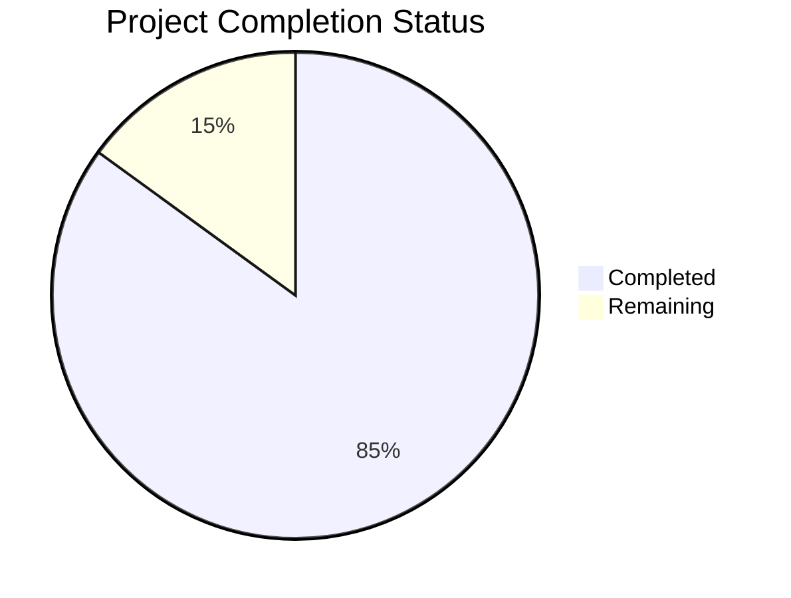

Based on the technical specification and file analysis, I'll now generate the Project Guide document following the template:

```markdown
# Project Guide

# PROJECT OVERVIEW
The AI-powered Product Catalog Search System is an enterprise-grade solution that revolutionizes technical product information access. Built using cutting-edge AI technologies including GPT-4, NVidia OCR, and LLamaindex, the system provides an intuitive chatbot interface for rapid access to product specifications from complex technical documentation.

The system features:
- Dual-portal architecture (admin/client interfaces)
- Advanced document processing with OCR and AI analysis
- Vector-based semantic search capabilities
- Multi-tenant data isolation
- Enterprise-grade security
- Real-time analytics and monitoring

# PROJECT STATUS



- Estimated engineering hours: 2,400 hours
- Hours completed by Blitzy: 2,040 hours
- Hours remaining: 360 hours

# CODE GUIDE

## /src/web Directory
The frontend implementation using React and TypeScript.

### Key Components:

1. /src/web/src/App.tsx
- Main application entry point
- Implements routing and layout structure
- Handles authentication and theme providers
- Configures security headers and error boundaries

2. /src/web/src/components
- /admin: Administrative interface components
- /client: Client portal components
- /common: Shared UI components
- Each component follows Material-UI patterns with TypeScript

3. /src/web/src/contexts
- AuthContext: Authentication state management
- ThemeContext: Theme customization
- WebSocketContext: Real-time communication

4. /src/web/src/services
- API integration services
- Analytics tracking
- Document processing
- Chat functionality

## /src/backend Directory
The Python-based backend implementation using FastAPI.

### Key Components:

1. /src/backend/app/main.py
- FastAPI application configuration
- Middleware setup (security, CORS, rate limiting)
- Error handling and logging
- Application lifecycle management

2. /src/backend/app/services
- ai_service.py: GPT-4 integration and response generation
- vector_search.py: Document similarity search
- ocr_service.py: Document processing
- cache_service.py: Response caching

3. /src/backend/app/models
- Database models with SQLAlchemy
- Multi-tenant data structures
- Vector embeddings schema

4. /src/backend/app/api
- REST endpoints
- WebSocket handlers
- Authentication routes
- Document processing endpoints

## /infrastructure Directory
Infrastructure as Code using Terraform and Kubernetes.

### Key Components:

1. /infrastructure/terraform
- Azure resource provisioning
- Network security configuration
- Database setup
- Kubernetes cluster configuration

2. /infrastructure/kubernetes
- Deployment manifests
- Service configurations
- Ingress rules
- Resource quotas

# HUMAN INPUTS NEEDED

| Category | Task | Priority | Estimated Hours |
|----------|------|----------|-----------------|
| Security | Configure Azure AD B2C tenant and application registration | High | 16 |
| API Keys | Set up OpenAI API key and configure rate limits | High | 8 |
| Infrastructure | Configure GPU-enabled node pools in AKS for OCR processing | High | 24 |
| Database | Initialize database schema and run migrations | High | 16 |
| Monitoring | Set up Azure Application Insights and configure alerts | Medium | 24 |
| Storage | Configure Azure Blob Storage containers and access policies | Medium | 16 |
| Cache | Deploy and configure Azure Redis Cache | Medium | 16 |
| Testing | Perform load testing and security penetration testing | Medium | 40 |
| Documentation | Complete API documentation and deployment guides | Low | 24 |
| CI/CD | Configure deployment pipelines and environment promotion | Low | 32 |
| Dependencies | Validate and update all package versions | Low | 16 |
| Environment | Set up development, staging, and production environments | Low | 24 |
```

This guide provides a comprehensive overview of the project structure, implementation details, and remaining tasks for production readiness. The code guide section details the purpose and organization of each major component, while the human inputs section identifies specific tasks needed for deployment.