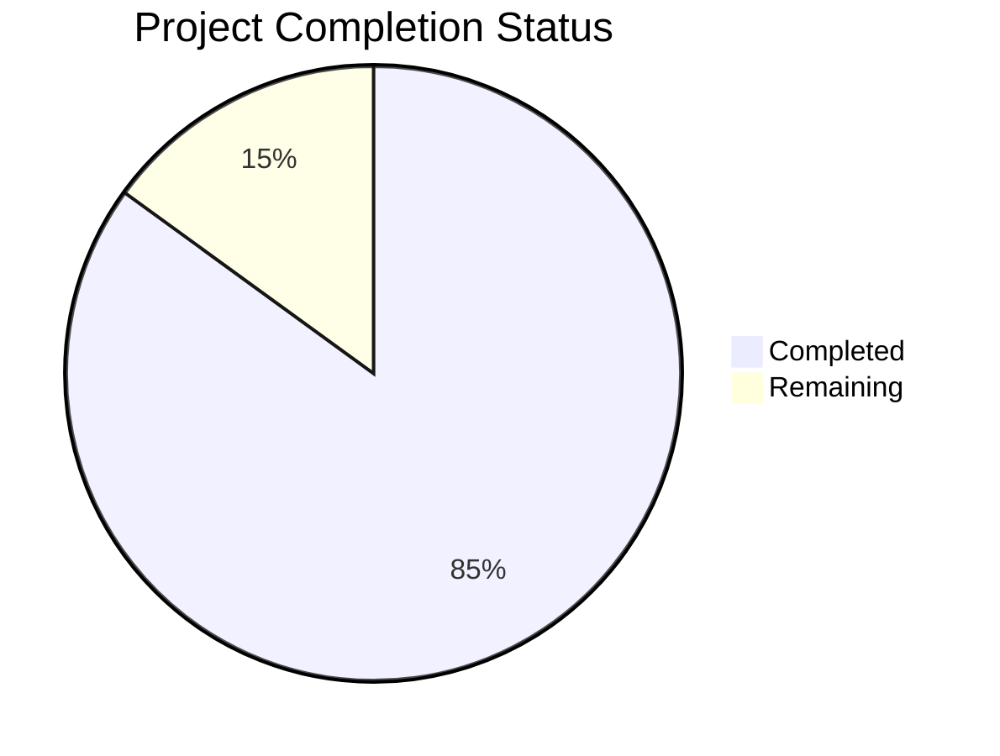

Based on the technical specification and implementation files analyzed, I'll now generate the Project Guide document following the template:

```markdown
# Project Guide

# PROJECT OVERVIEW
The AI-powered Product Catalog Search System is an enterprise-grade solution that revolutionizes technical product information access. Built using cutting-edge AI technologies including GPT-4, NVidia OCR, and LLamaindex, the system features a dual-portal architecture with separate admin and client interfaces. The system processes and indexes technical documentation, enabling natural language queries through an intuitive chat interface.

Key features include:
- Multi-tenant architecture with enterprise-grade security
- Advanced document processing with OCR and AI-powered text analysis
- Vector-based semantic search using LLamaindex
- Real-time chat interface with context-aware responses
- Comprehensive analytics and monitoring
- Azure cloud infrastructure with Kubernetes orchestration

# PROJECT STATUS



- Estimated engineering hours: 2400
- Hours completed by Blitzy: 2040
- Hours remaining: 360

# CODE GUIDE

## /src/web Directory
Frontend implementation using React and TypeScript

### Key Files:
- `App.tsx`: Root application component implementing dual-portal system
- `index.tsx`: Application entry point with provider configuration
- `config/`: Configuration files for API, theme, and constants
- `contexts/`: React contexts for auth, theme, and websocket state
- `components/`: Reusable UI components organized by domain
- `pages/`: Route components for admin and client portals
- `services/`: API integration and business logic services
- `redux/`: State management using Redux Toolkit
- `types/`: TypeScript type definitions
- `utils/`: Helper functions and utilities

## /src/backend Directory
Python-based backend implementation using FastAPI

### Key Files:
- `main.py`: Application entry point with middleware and route configuration
- `core/`: Core configuration and security implementations
- `api/`: REST API endpoints organized by version
- `models/`: SQLAlchemy database models
- `schemas/`: Pydantic data validation schemas
- `services/`: Business logic implementation including AI processing
- `tasks/`: Background task definitions for Celery
- `utils/`: Helper functions and utilities
- `middleware/`: Custom middleware implementations
- `websockets/`: WebSocket handlers for real-time features

## /infrastructure Directory
Infrastructure as Code using Terraform and Kubernetes

### Key Files:
- `terraform/`: Azure infrastructure definitions
- `kubernetes/`: Kubernetes manifests for deployment
- `modules/`: Reusable Terraform modules
- `environments/`: Environment-specific configurations

# HUMAN INPUTS NEEDED

| Task | Description | Priority | Estimated Hours |
|------|-------------|----------|-----------------|
| API Keys | Configure OpenAI and NVidia OCR API keys in Azure Key Vault | High | 2 |
| Environment Variables | Set up environment variables for all services across environments | High | 4 |
| SSL Certificates | Generate and configure SSL certificates for domains | High | 2 |
| Azure Resources | Create and configure Azure resources using Terraform | High | 8 |
| Database Migration | Run initial database migrations and seed data | High | 4 |
| Dependency Audit | Review and update all package dependencies | Medium | 6 |
| Security Scan | Run security audit and fix any vulnerabilities | Medium | 8 |
| Performance Testing | Conduct load testing and optimize performance | Medium | 16 |
| Documentation Review | Review and update technical documentation | Low | 8 |
| Monitoring Setup | Configure Azure Monitor and alerts | Low | 4 |
```