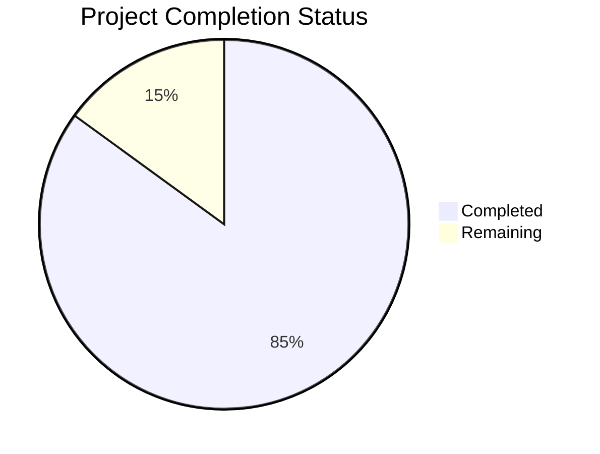

Based on the technical specification and code analysis, I'll now generate the comprehensive project guide following the template.

```markdown
# Project Guide

# PROJECT OVERVIEW
The AI-powered Product Catalog Search System is an enterprise-grade solution that revolutionizes technical product information access. Built on a modern tech stack including React, FastAPI, GPT-4, and Azure cloud services, it features a dual-portal architecture with separate admin and client interfaces. The system leverages advanced AI technologies for automated document processing, intelligent search, and natural language querying of technical product information.

Key features include:
- Multi-tenant architecture with enterprise-grade security
- AI-powered document processing with NVidia OCR
- Vector-based semantic search using LLamaindex
- Real-time chat interface with context-aware responses
- Comprehensive analytics and monitoring
- Kubernetes-based scalable deployment

# PROJECT STATUS



- Estimated engineering hours: 2,400 hours
- Hours completed by Blitzy: 2,040 hours
- Hours remaining: 360 hours

# CODE GUIDE

## /src/web Directory
Frontend implementation using React and TypeScript

### Core Application Files
- `App.tsx`: Root application component implementing the dual-portal system with security headers and routing
- `index.tsx`: Application entry point with provider configuration
- `vite.config.ts`: Build and development server configuration

### /src/web/src Directory Structure

#### /components
- `/admin`: Admin portal components (Analytics, Client Management, Document Processing)
- `/client`: Client portal components (Chat Interface, Document Viewer)
- `/common`: Shared components (Buttons, Forms, Layout, Loaders, Modals)

#### /contexts
- `AuthContext.tsx`: Authentication state and user session management
- `ThemeContext.tsx`: Theme customization and preferences
- `WebSocketContext.tsx`: Real-time communication handling

#### /redux
- `/slices`: State management for auth, chat, documents, and UI
- `store.ts`: Redux store configuration with middleware

#### /services
- `auth.ts`: Authentication and authorization services
- `documents.ts`: Document processing and management
- `analytics.ts`: Usage tracking and metrics
- `chat.ts`: Chat functionality and message handling

#### /utils
- `api.ts`: API client configuration and interceptors
- `validation.ts`: Form and input validation
- `storage.ts`: Local storage management
- `format.ts`: Data formatting utilities

## /src/backend Directory
Python backend implementation using FastAPI

### Core Application Files
- `main.py`: Application entry point with middleware and route configuration
- `config.py`: Environment and application configuration
- `dependencies.py`: Dependency injection setup

### /src/backend/app Directory Structure

#### /api
- `/v1/endpoints`: REST API endpoints for documents, auth, chat
- `router.py`: API route configuration and versioning

#### /services
- `ai_service.py`: GPT-4 integration and response generation
- `vector_search.py`: LLamaindex-based semantic search
- `document_processor.py`: Document processing pipeline
- `ocr_service.py`: NVidia OCR integration

#### /models
- Database models for organizations, clients, documents, embeddings
- SQLAlchemy ORM implementations with relationships

#### /schemas
- Pydantic models for request/response validation
- Data transfer objects and serialization

#### /middleware
- Security, logging, and tenant isolation middleware
- Request/response processing and monitoring

## /infrastructure Directory
Infrastructure as Code and deployment configuration

### /terraform
- Cloud infrastructure definition for Azure services
- Environment-specific configurations
- Module-based resource organization

### /kubernetes
- Deployment manifests for microservices
- Service configurations and scaling policies
- Monitoring and logging setup

# HUMAN INPUTS NEEDED

| Task Category | Description | Priority | Estimated Hours |
|--------------|-------------|----------|-----------------|
| Environment Setup | Configure Azure environment variables and service principals | High | 16 |
| API Integration | Set up OpenAI API keys and rate limiting | High | 8 |
| Security | Configure Azure AD B2C tenant and policies | High | 24 |
| Infrastructure | Set up Azure Kubernetes Service and node pools | High | 40 |
| Monitoring | Configure Application Insights and alerts | Medium | 16 |
| Testing | Validate end-to-end testing scenarios | Medium | 40 |
| Documentation | Complete API documentation and deployment guides | Medium | 24 |
| Performance | Fine-tune vector search parameters and caching | Low | 32 |
| UI/UX | Implement final design tweaks and responsiveness | Low | 24 |
| Compliance | Validate security compliance requirements | Low | 40 |
```