# Technical Specifications

# 1. INTRODUCTION

## 1.1 EXECUTIVE SUMMARY

The AI-powered Product Catalog Search System represents a transformative solution for organizations struggling with efficient access to technical product information. By leveraging advanced AI technologies including GPT-4, NVidia OCR, and LLamaindex, the system automates the extraction, processing, and retrieval of product information from complex technical documentation.

This solution addresses the critical business challenge of manual catalog searching, which currently consumes significant time and resources while being prone to human error. The system will serve industrial sales engineers, technical service professionals, and new employees, providing them with an intuitive chatbot interface for rapid, accurate access to product specifications and technical details.

## 1.2 SYSTEM OVERVIEW

### Project Context

| Aspect | Details |
|--------|----------|
| Market Position | First-to-market AI-powered catalog search solution for industrial technical documentation |
| Current Limitations | Manual searching, fragmented information access, high training overhead |
| Enterprise Integration | Seamless integration with existing document management systems and authentication infrastructure |

### High-Level Description

| Component | Implementation |
|-----------|----------------|
| Frontend Layer | React-based dual-portal system (admin/client) |
| Processing Pipeline | NVidia OCR + GPT-4 for document processing |
| Search Engine | LLamaindex-powered vector search and retrieval |
| Storage Infrastructure | Multi-tenant Azure cloud architecture |
| Security Framework | Enterprise-grade encryption and access controls |

### Success Criteria

| Metric | Target |
|--------|---------|
| Search Time Reduction | 80% decrease in time to find specific product information |
| Information Accuracy | 95%+ accuracy in returned search results |
| User Adoption | 90% user satisfaction rate within 3 months |
| System Performance | 99.9% uptime with sub-minute query responses |

## 1.3 SCOPE

### In-Scope Elements

#### Core Features and Functionalities

| Category | Components |
|----------|------------|
| Document Processing | - Multi-format document ingestion (PDF, Word, Excel)<br>- Advanced OCR processing<br>- AI-powered text analysis |
| Search Capabilities | - Natural language query processing<br>- Context-aware responses<br>- Multi-document knowledge synthesis |
| Administration | - Client account management<br>- Usage analytics<br>- Portal customization |
| Security | - Multi-tenant data isolation<br>- Role-based access control<br>- Audit logging |

#### Implementation Boundaries

| Boundary Type | Coverage |
|---------------|----------|
| User Groups | - System administrators<br>- Sales engineers<br>- Technical service staff<br>- New employees |
| Geographic Scope | Global deployment with multi-region support |
| Data Domains | Technical product specifications, catalogs, and manuals |
| Language Support | English language documents and queries |

### Out-of-Scope Elements

- Real-time document collaboration features
- Mobile application development
- Integration with ERP systems
- Multi-language support (planned for future phases)
- Image and video content processing
- Custom machine learning model training
- Legacy system data migration
- Third-party marketplace integration

# 2. SYSTEM ARCHITECTURE

## 2.1 High-Level Architecture

```mermaid
C4Context
    title System Context Diagram (Level 0)
    
    Person(admin, "Administrator", "System admin managing clients and catalogs")
    Person(client, "Client User", "End user querying product information")
    
    System_Boundary(system, "AI-Powered Product Catalog Search System") {
        System(web, "Web Application", "React-based dual portal system")
        System(ai, "AI Processing Pipeline", "Document processing and query handling")
        System(data, "Data Storage Layer", "Multi-tenant data management")
    }
    
    System_Ext(gpt4, "GPT-4 API", "Language model service")
    System_Ext(nvidia, "NVidia OCR", "Document processing service")
    System_Ext(azure, "Azure Services", "Cloud infrastructure")
    
    Rel(admin, web, "Manages catalogs and clients")
    Rel(client, web, "Queries product information")
    Rel(web, ai, "Processes documents and queries")
    Rel(ai, data, "Stores and retrieves data")
    Rel(ai, gpt4, "Natural language processing")
    Rel(ai, nvidia, "OCR processing")
    Rel(system, azure, "Hosted on")
```

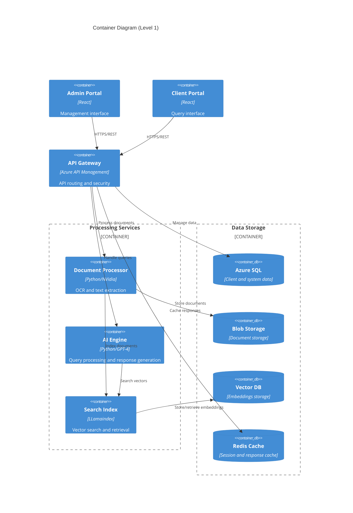

## 2.2 Component Details

### 2.2.1 Frontend Components

| Component | Details |
|-----------|----------|
| Admin Portal | - React SPA with Material-UI<br>- Redux state management<br>- JWT authentication<br>- Real-time updates via WebSocket<br>- Analytics dashboard integration |
| Client Portal | - React SPA with custom UI components<br>- Context-based state management<br>- Chat interface with streaming responses<br>- Session management<br>- Responsive design |

### 2.2.2 Backend Services

| Service | Specifications |
|---------|---------------|
| API Gateway | - Azure API Management<br>- Rate limiting and throttling<br>- Request validation<br>- API versioning<br>- OAuth2/JWT authentication |
| Document Processor | - Python microservice<br>- NVidia OCR integration<br>- Async processing pipeline<br>- Queue-based job management<br>- Error recovery mechanisms |
| AI Engine | - Python microservice<br>- GPT-4 integration<br>- Response generation logic<br>- Context management<br>- Accuracy verification |
| Search Index | - LLamaindex framework<br>- Vector similarity search<br>- Document chunking<br>- Embedding generation<br>- Query optimization |

### 2.2.3 Data Storage Components

| Store | Implementation |
|-------|---------------|
| Azure SQL | - Multi-tenant schema<br>- Row-level security<br>- Automated backups<br>- Read replicas<br>- Performance monitoring |
| Blob Storage | - Document versioning<br>- Access control<br>- Lifecycle management<br>- Geo-replication<br>- Encryption at rest |
| Vector Database | - High-dimensional vectors<br>- Fast similarity search<br>- Scalable indexing<br>- Automatic sharding<br>- Backup/restore |
| Redis Cache | - Session data<br>- Query results<br>- Rate limiting data<br>- Distributed locking<br>- Cache invalidation |

## 2.3 Technical Decisions

### 2.3.1 Architecture Patterns

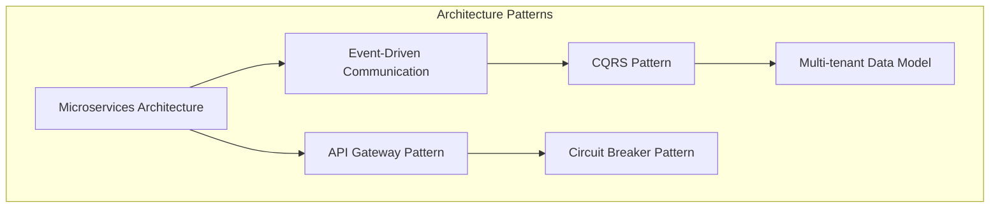

### 2.3.2 Communication Patterns

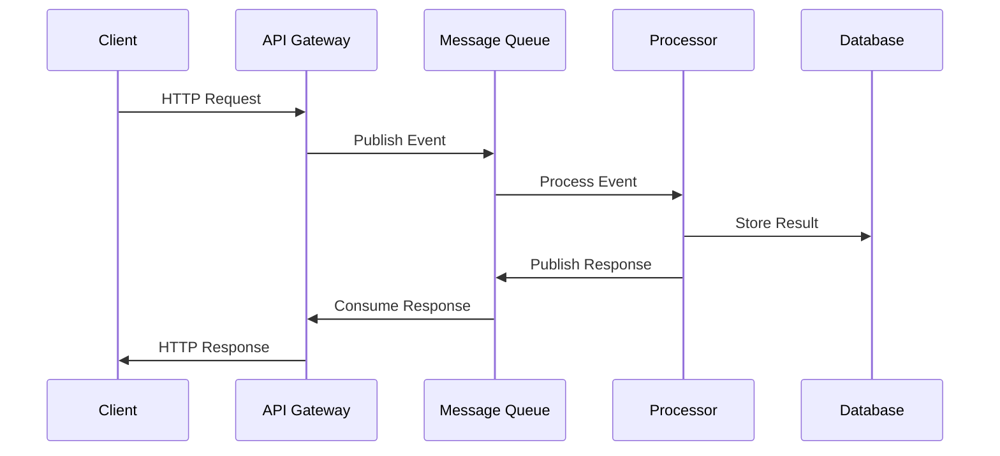

## 2.4 Cross-Cutting Concerns

### 2.4.1 Monitoring and Observability

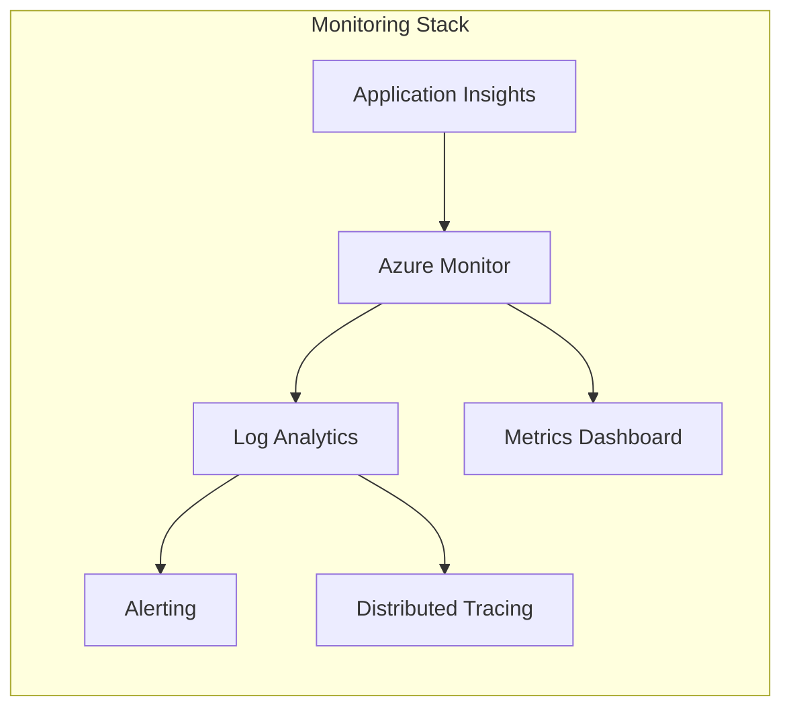

### 2.4.2 Security Architecture

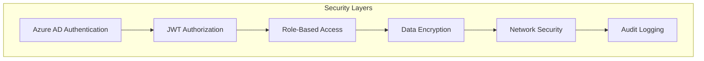

### 2.4.3 Deployment Architecture

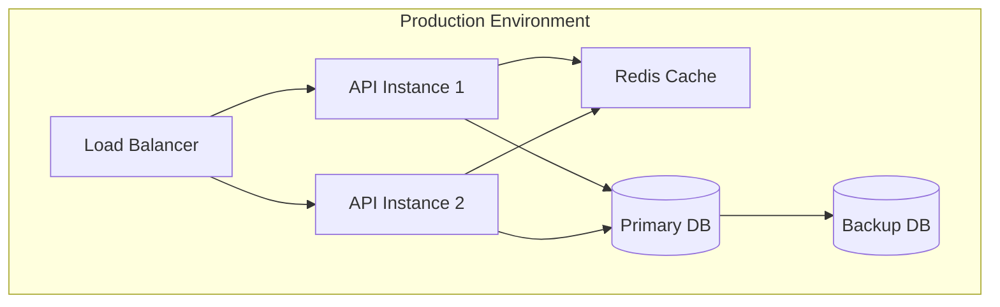

## 2.5 Infrastructure Requirements

| Component | Specifications |
|-----------|---------------|
| Compute | - Azure Kubernetes Service<br>- Autoscaling node pools<br>- GPU-enabled instances for OCR<br>- High-memory instances for AI |
| Network | - Virtual Network isolation<br>- Application Gateway<br>- Private endpoints<br>- DDoS protection |
| Storage | - Premium SSD storage<br>- Geo-redundant backup<br>- Data lifecycle management<br>- Performance tiers |
| Security | - Key Vault integration<br>- Managed identities<br>- Network security groups<br>- WAF policies |

# 3. SYSTEM COMPONENTS ARCHITECTURE

## 3.1 USER INTERFACE DESIGN

### 3.1.1 Design System Specifications

| Component | Requirements |
|-----------|--------------|
| Typography | - Primary: Roboto<br>- Secondary: Open Sans<br>- Code: Fira Mono<br>- Scale: 12/14/16/20/24/32px |
| Color Palette | - Primary: #0066CC<br>- Secondary: #4CAF50<br>- Error: #DC3545<br>- Warning: #FFC107<br>- Info: #17A2B8 |
| Spacing System | - Base unit: 8px<br>- Grid: 12-column fluid<br>- Breakpoints: 576/768/992/1200px |
| Components | - Material-UI v5 base<br>- Custom chat components<br>- Document viewer components |

### 3.1.2 Portal Layouts

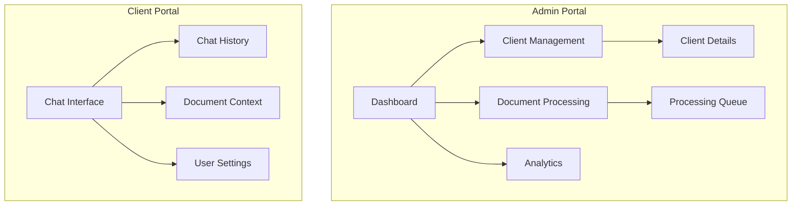

### 3.1.3 Critical User Flows

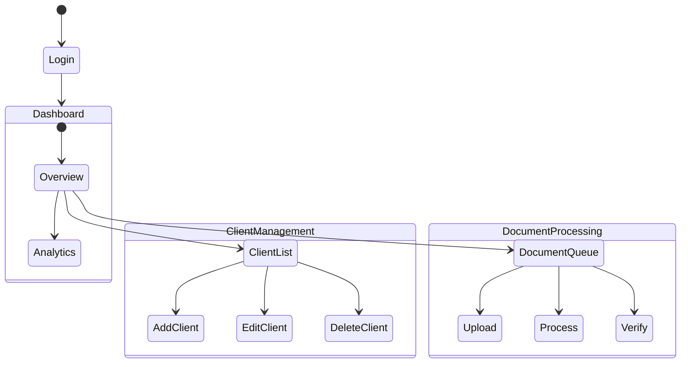

### 3.1.4 Accessibility & Compatibility

| Category | Requirements |
|----------|--------------|
| WCAG Compliance | Level AA 2.1 |
| Browser Support | Chrome 90+, Firefox 88+, Safari 14+, Edge 90+ |
| Device Support | Desktop, Tablet (iPad/Android), Mobile (iOS/Android) |
| Screen Sizes | 320px to 4K resolution |
| Color Contrast | Minimum ratio 4.5:1 |
| Dark Mode | Supported with system preference detection |

## 3.2 DATABASE DESIGN

### 3.2.1 Schema Design

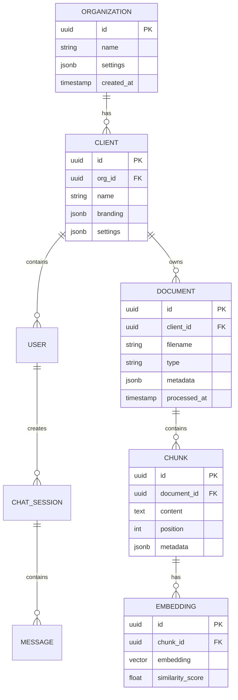

### 3.2.2 Data Management Strategy

| Aspect | Implementation |
|--------|----------------|
| Partitioning | - Client-based partitioning<br>- Time-based partitioning for chat history<br>- Size-based partitioning for documents |
| Indexing | - B-tree indexes for primary keys<br>- GiST indexes for vector similarity<br>- Composite indexes for frequent queries |
| Caching | - Redis for session data<br>- Materialized views for analytics<br>- Query result caching |
| Backup | - Daily full backups<br>- Hourly incremental backups<br>- Point-in-time recovery |

### 3.2.3 Performance Optimization

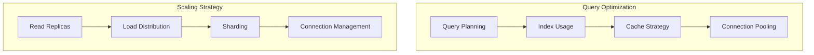

## 3.3 API DESIGN

### 3.3.1 API Architecture

| Component | Specification |
|-----------|---------------|
| Protocol | REST over HTTPS |
| Authentication | OAuth 2.0 + JWT |
| Rate Limiting | 1000 requests/hour/client |
| Versioning | URI-based (v1, v2) |
| Documentation | OpenAPI 3.0 |
| Response Format | JSON with HAL links |

### 3.3.2 Endpoint Specifications

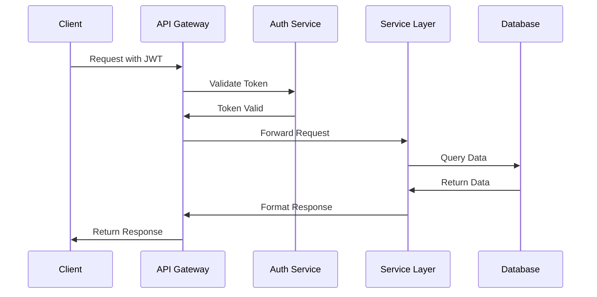

### 3.3.3 Integration Patterns

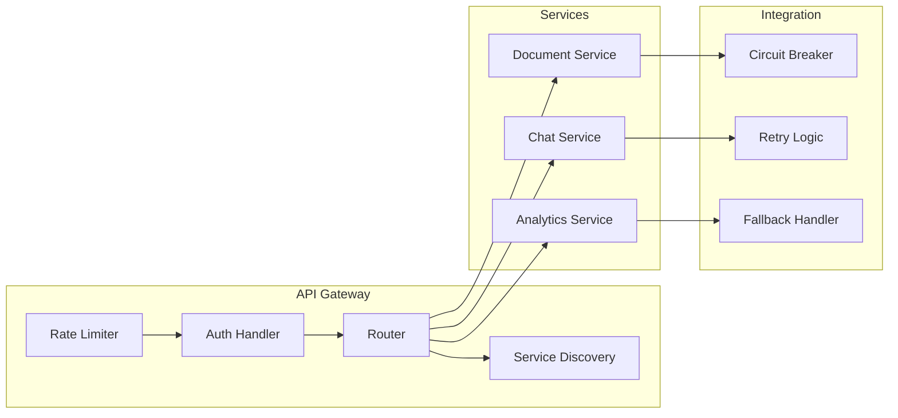

### 3.3.4 API Security Controls

| Control | Implementation |
|---------|----------------|
| Authentication | - OAuth 2.0 flows<br>- JWT validation<br>- Token refresh mechanism |
| Authorization | - Role-based access control<br>- Scope-based permissions<br>- Resource-level ACLs |
| Encryption | - TLS 1.3 required<br>- Response encryption<br>- Sensitive data masking |
| Validation | - Input sanitization<br>- Schema validation<br>- Content-type verification |

# 4. TECHNOLOGY STACK

## 4.1 PROGRAMMING LANGUAGES

| Platform/Component | Language | Version | Justification |
|-------------------|----------|---------|---------------|
| Frontend | TypeScript | 5.0+ | - Strong typing for enterprise applications<br>- Enhanced IDE support<br>- Better maintainability for large codebases |
| Backend | Python | 3.11+ | - Extensive AI/ML library ecosystem<br>- Integration with GPT-4 and LLamaindex<br>- Efficient async processing capabilities |
| Infrastructure | Go | 1.21+ | - High-performance microservices<br>- Efficient resource utilization<br>- Strong concurrency support |
| Scripts/Automation | Python | 3.11+ | - Consistent with backend ecosystem<br>- Rich DevOps tooling support<br>- Cross-platform compatibility |

## 4.2 FRAMEWORKS & LIBRARIES

### Frontend Stack

| Component | Technology | Version | Purpose |
|-----------|------------|---------|----------|
| Core Framework | React | 18.2+ | - Component-based architecture<br>- Virtual DOM for performance<br>- Large ecosystem support |
| State Management | Redux Toolkit | 1.9+ | - Centralized state management<br>- Built-in middleware support<br>- TypeScript integration |
| UI Components | Material-UI | 5.14+ | - Enterprise-grade components<br>- Customizable theming<br>- Accessibility compliance |
| API Client | Axios | 1.5+ | - Promise-based HTTP client<br>- Request/response interceptors<br>- Retry mechanisms |

### Backend Stack

| Component | Technology | Version | Purpose |
|-----------|------------|---------|----------|
| Web Framework | FastAPI | 0.103+ | - High-performance async support<br>- Built-in OpenAPI documentation<br>- Type checking integration |
| AI Framework | LLamaindex | 0.8+ | - Vector store integration<br>- Document chunking capabilities<br>- Query optimization |
| OCR Processing | NVidia OCR SDK | Latest | - GPU-accelerated processing<br>- High accuracy rates<br>- Enterprise support |
| Task Queue | Celery | 5.3+ | - Distributed task processing<br>- Result backend support<br>- Monitoring capabilities |

## 4.3 DATABASES & STORAGE

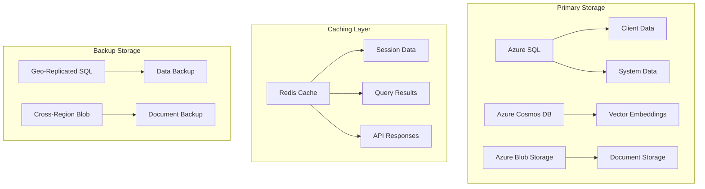

| Storage Type | Technology | Purpose | Configuration |
|--------------|------------|---------|---------------|
| Primary Database | Azure SQL | Client/system data | - Multi-tenant architecture<br>- Geo-replication enabled<br>- Automatic scaling |
| Vector Database | Azure Cosmos DB | Embeddings storage | - Multi-region writes<br>- Automatic indexing<br>- Consistency level: Session |
| Document Storage | Azure Blob Storage | Raw document storage | - ZRS enabled<br>- Lifecycle management<br>- Versioning enabled |
| Cache Layer | Azure Redis Cache | Performance optimization | - Premium tier<br>- 6GB memory<br>- Cluster mode |

## 4.4 THIRD-PARTY SERVICES

| Service Category | Provider | Purpose | Integration Method |
|-----------------|----------|---------|-------------------|
| AI Processing | OpenAI GPT-4 | Natural language processing | REST API with retry logic |
| OCR Processing | NVidia | Document text extraction | SDK integration |
| Authentication | Azure AD B2C | Identity management | OAuth 2.0/OIDC |
| Monitoring | Azure Monitor | System monitoring | SDK integration |
| Analytics | Azure Application Insights | Performance monitoring | Auto-instrumentation |

## 4.5 DEVELOPMENT & DEPLOYMENT

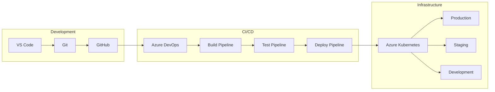

### Development Tools

| Category | Tool | Version | Purpose |
|----------|------|---------|----------|
| IDE | VS Code | Latest | Primary development environment |
| Version Control | Git | 2.40+ | Source code management |
| Package Management | Poetry/npm | Latest | Dependency management |
| Code Quality | ESLint/Pylint | Latest | Static code analysis |

### Deployment Configuration

| Component | Technology | Configuration |
|-----------|------------|---------------|
| Containerization | Docker | - Multi-stage builds<br>- Optimized images<br>- Security scanning |
| Orchestration | Azure Kubernetes | - Auto-scaling<br>- Rolling updates<br>- Health monitoring |
| CI/CD | Azure DevOps | - Automated testing<br>- Security scanning<br>- Environment promotion |
| Infrastructure | Terraform | - Infrastructure as code<br>- State management<br>- Module organization |

# 5. SYSTEM DESIGN

## 5.1 USER INTERFACE DESIGN

### 5.1.1 Admin Portal Layout

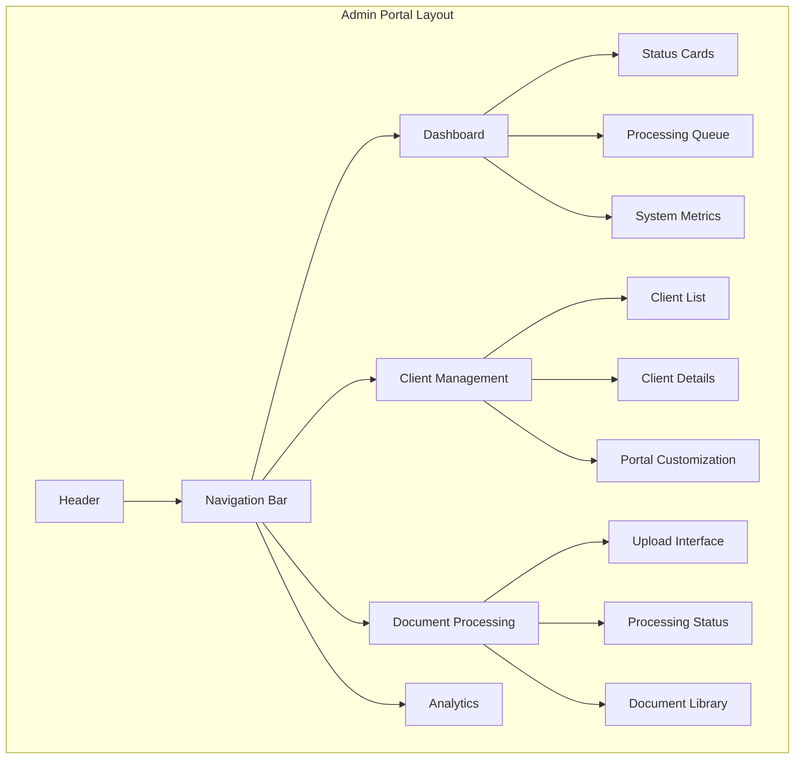

### 5.1.2 Client Portal Layout

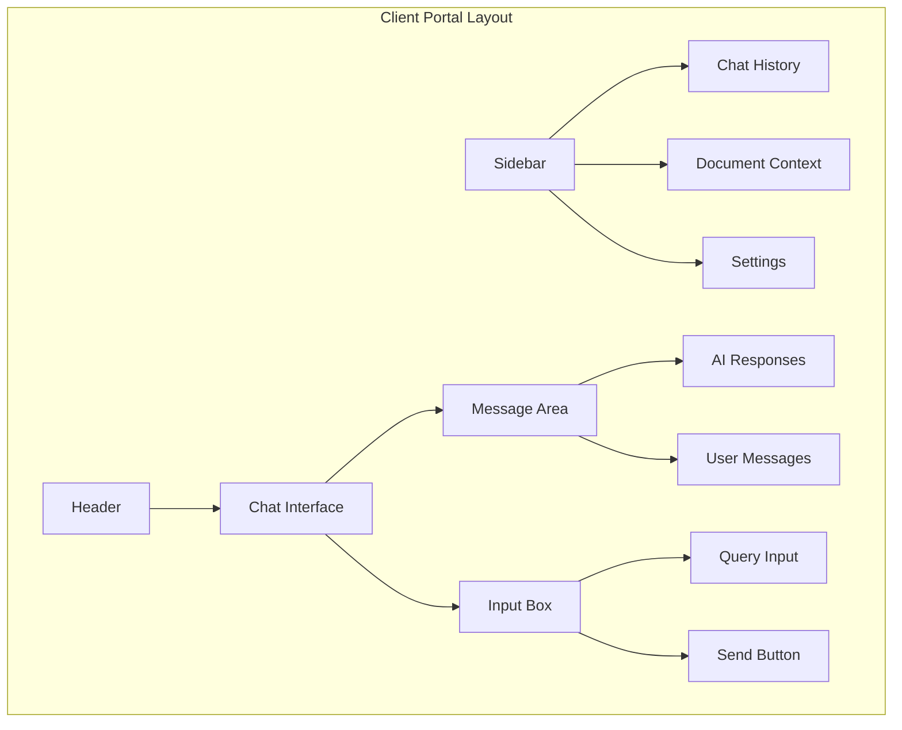

### 5.1.3 Component Specifications

| Component | Specifications |
|-----------|----------------|
| Chat Interface | - Floating message bubbles<br>- Markdown rendering<br>- Code block support<br>- LaTeX equation rendering |
| Document Viewer | - PDF preview<br>- Word/Excel thumbnails<br>- Progress indicators<br>- Error states |
| Analytics Dashboard | - Real-time charts<br>- Filterable tables<br>- Export functionality<br>- Date range selection |
| Upload Interface | - Drag-and-drop zone<br>- Multi-file support<br>- Progress tracking<br>- Validation feedback |

## 5.2 DATABASE DESIGN

### 5.2.1 Schema Architecture

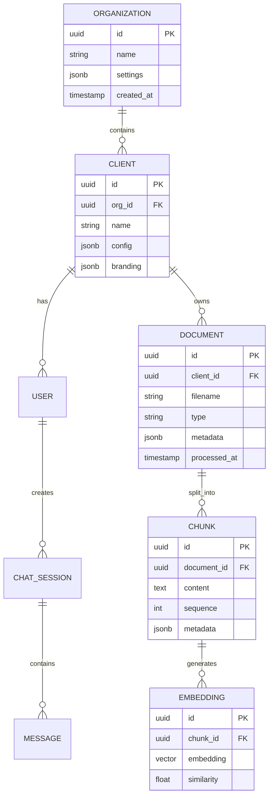

### 5.2.2 Data Storage Strategy

| Storage Type | Implementation | Purpose |
|--------------|----------------|----------|
| Relational Data | Azure SQL Database | Client/user management, document metadata |
| Vector Data | Azure Cosmos DB | Document embeddings, similarity search |
| Document Storage | Azure Blob Storage | Raw document files, processed artifacts |
| Cache Layer | Azure Redis Cache | Session data, frequent queries |

## 5.3 API DESIGN

### 5.3.1 REST Endpoints

| Endpoint | Method | Purpose | Request/Response |
|----------|---------|---------|------------------|
| `/api/v1/documents` | POST | Upload document | Multipart form data / Processing status |
| `/api/v1/documents/{id}` | GET | Retrieve document | - / Document metadata |
| `/api/v1/query` | POST | Process query | Query text / AI response |
| `/api/v1/clients` | POST | Create client | Client data / Client details |
| `/api/v1/analytics` | GET | Retrieve metrics | Query params / Analytics data |

### 5.3.2 API Communication Flow

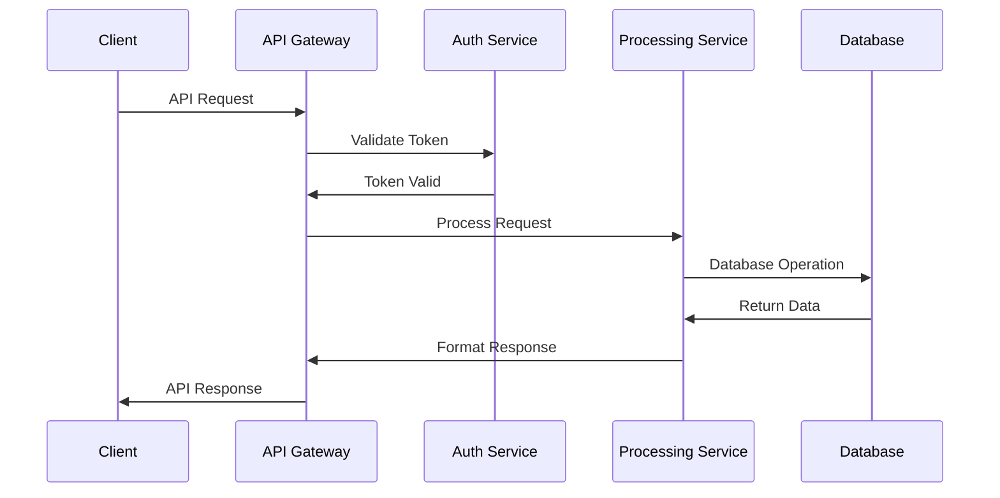

### 5.3.3 WebSocket Events

| Event | Direction | Purpose | Payload |
|-------|-----------|---------|---------|
| `document.processing` | Server→Client | Processing updates | Status, progress |
| `chat.message` | Bidirectional | Real-time chat | Message content |
| `system.status` | Server→Client | System notifications | Status updates |
| `client.activity` | Client→Server | User actions | Activity data |

### 5.3.4 Error Handling

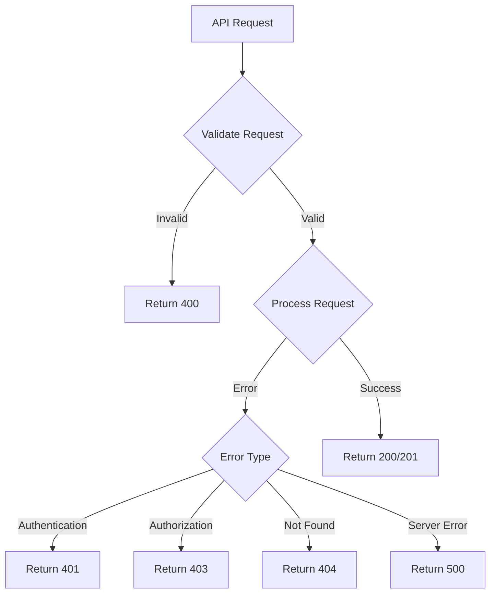

# 6. USER INTERFACE DESIGN

## 6.1 Design System

### 6.1.1 Common UI Elements Key

```
Icons:
[?] - Help/Information tooltip
[$] - Payment/Billing related
[i] - Information indicator
[+] - Add new item
[x] - Close/Delete/Remove
[<] [>] - Navigation arrows
[^] - Upload function
[#] - Menu/Dashboard
[@] - User profile
[!] - Alert/Warning
[=] - Settings menu
[*] - Favorite/Important

Input Elements:
[ ] - Checkbox
( ) - Radio button
[...] - Text input field
[====] - Progress bar
[v] - Dropdown menu
[Button] - Clickable button

Layout Elements:
+--+ - Container border
|  | - Vertical separator
+-- - Hierarchy indicator
```

## 6.2 Admin Portal Wireframes

### 6.2.1 Admin Dashboard

```
+----------------------------------------------------------+
|  AI-Powered Catalog Search - Admin Portal        [@] [=]   |
+----------------------------------------------------------+
|  [#] Dashboard                                            |
|  +-- Clients                                              |
|  +-- Documents                                            |
|  +-- Analytics                                            |
|  +-- Settings                                             |
+----------------------------------------------------------+
|                                                           |
|  System Overview                       Quick Actions      |
|  +------------------------+  +--------------------------+ |
|  | Active Clients: 45     |  | [+] Add New Client      | |
|  | Documents: 1,247       |  | [^] Upload Documents    | |
|  | Processing Queue: 12   |  | [!] Review Alerts (3)   | |
|  +------------------------+  +--------------------------+ |
|                                                          |
|  Recent Processing                                       |
|  +--------------------------------------------------+   |
|  | Document         | Status    | Progress   | Action |   |
|  | Catalog_A.pdf    | Complete  | [====100%] | [x]    |   |
|  | Manual_B.docx    | Processing| [====45%]  | [x]    |   |
|  | Specs_C.xlsx     | Queued    | [0%]       | [x]    |   |
|  +--------------------------------------------------+   |
|                                                          |
+----------------------------------------------------------+
```

### 6.2.2 Client Management Interface

```
+----------------------------------------------------------+
|  Client Management                              [@] [=]    |
+----------------------------------------------------------+
|  [+] Add New Client                Search: [...........]  |
+----------------------------------------------------------+
|  Client List                                              |
|  +--------------------------------------------------+    |
|  | Name     | Status  | Documents | Last Active      |    |
|  |-------------------------------------------------|    |
|  | ACME Inc | Active  | 156       | 2024-01-20      |    |
|  | TechCorp | Active  | 89        | 2024-01-19      |    |
|  | DevFirm  | Pending | 0         | -               |    |
|  +--------------------------------------------------+    |
|                                                           |
|  Client Details                                          |
|  +--------------------------------------------------+    |
|  | Company Information        | Portal Settings      |    |
|  | Name: [................]  | Theme: [v]           |    |
|  | Industry: [v]             | Language: [v]        |    |
|  | Max Users: [.........]    | Features: [ ] Chat   |    |
|  |                           |          [ ] Export   |    |
|  | [Save Changes] [Delete Client]                    |    |
|  +--------------------------------------------------+    |
+----------------------------------------------------------+
```

## 6.3 Client Portal Wireframes

### 6.3.1 Chat Interface

```
+----------------------------------------------------------+
|  Product Knowledge Assistant                     [@] [=]   |
+----------------------------------------------------------+
|  +---------------+  +--------------------------------+     |
|  | Chat History  |  | Current Chat                   |     |
|  | [*] Saved     |  |                               |     |
|  | +-- Today     |  | [i] System: How can I help?   |     |
|  | |  +-- #1234  |  |                               |     |
|  | |  +-- #1235  |  | User: Specifications for      |     |
|  | +-- Yesterday |  | pump model A123?              |     |
|  |    +-- #1233  |  |                               |     |
|  |              |  | [i] System: Here are the       |     |
|  | [+] New Chat  |  | specifications for A123:      |     |
|  |              |  | - Flow rate: 500 GPM          |     |
|  |              |  | - Pressure: 150 PSI           |     |
|  |              |  | - Power: 75 HP                |     |
|  |              |  |                               |     |
|  +---------------+  | [...........................] |     |
|                    | [Send Message]  [?] Help      |     |
|                    +--------------------------------+     |
+----------------------------------------------------------+
```

### 6.3.2 Document Context View

```
+----------------------------------------------------------+
|  Document Context                               [@] [=]    |
+----------------------------------------------------------+
|  Current Reference Documents                              |
|  +--------------------------------------------------+    |
|  | Document Name        | Section    | Relevance     |    |
|  | Pump Catalog 2024    | Page 45    | [====95%]     |    |
|  | Technical Manual     | Section 3.2| [====87%]     |    |
|  | Specifications Sheet | Table 12   | [====82%]     |    |
|  +--------------------------------------------------+    |
|                                                           |
|  Document Preview                                         |
|  +--------------------------------------------------+    |
|  | [<] Page 45 [>]                                   |    |
|  |                                                    |    |
|  | Model A123 Specifications                         |    |
|  | +----------------+-------------+                   |    |
|  | | Parameter     | Value       |                   |    |
|  | | Flow Rate     | 500 GPM     |                   |    |
|  | | Pressure      | 150 PSI     |                   |    |
|  | +----------------+-------------+                   |    |
|  |                                                    |    |
|  | [Download PDF] [Share Link]                       |    |
|  +--------------------------------------------------+    |
+----------------------------------------------------------+
```

## 6.4 Responsive Design Specifications

### 6.4.1 Breakpoints

```
Device Breakpoints:
+------------------+--------------------+
| Device           | Min Width          |
|------------------+--------------------|
| Mobile           | 320px              |
| Tablet           | 768px              |
| Desktop          | 1024px             |
| Large Desktop    | 1440px             |
+------------------+--------------------+

Layout Adjustments:
Mobile:
- Single column layout
- Collapsible sidebar
- Simplified chat interface
- Touch-optimized buttons (min 44px)

Tablet:
- Two-column layout where appropriate
- Visible sidebar with toggle
- Full chat interface
- Hybrid touch/mouse interface

Desktop:
- Full multi-column layout
- Persistent sidebar
- Extended chat interface
- Mouse-optimized interface
```

### 6.4.2 Navigation Patterns

```
Mobile Navigation:
+------------------+
| [=] Product Search|
+------------------+
| [#] Menu         |
| +-- Home         |
| +-- Chats        |
| +-- Documents    |
| +-- Settings     |
+------------------+

Desktop Navigation:
+--------------------------------------------------------+
| Product Search    [Home] [Chats] [Docs] [Settings] [@]  |
+--------------------------------------------------------+
```

# 7. SECURITY CONSIDERATIONS

## 7.1 AUTHENTICATION AND AUTHORIZATION

### 7.1.1 Authentication Methods

| Method | Implementation | Use Case |
|--------|----------------|-----------|
| OAuth 2.0 + OIDC | Azure AD B2C | Primary SSO authentication |
| JWT | Custom tokens with RSA-256 | API authentication |
| MFA | Time-based OTP | Additional security layer |
| API Keys | SHA-256 hashed | Service-to-service auth |

### 7.1.2 Authorization Matrix

| Role | Document Access | User Management | System Config | Analytics |
|------|----------------|-----------------|---------------|------------|
| System Admin | Full | Full | Full | Full |
| Client Admin | Own Documents | Own Users | Limited | Own Data |
| Regular User | Read Only | None | None | Own Usage |
| API Service | Configured | None | None | None |

```mermaid
flowchart TD
    A[Authentication Request] --> B{Auth Type}
    B -->|SSO| C[Azure AD B2C]
    B -->|API| D[JWT Validation]
    B -->|Service| E[API Key Check]
    
    C --> F{Token Valid?}
    D --> F
    E --> F
    
    F -->|Yes| G[Load Permissions]
    F -->|No| H[Reject Access]
    
    G --> I[Apply RBAC]
    I --> J[Grant Access]
```

## 7.2 DATA SECURITY

### 7.2.1 Encryption Standards

| Data State | Method | Key Management |
|------------|---------|----------------|
| In Transit | TLS 1.3 | Automatic rotation |
| At Rest | AES-256 | Azure Key Vault |
| In Memory | Secure memory encryption | Runtime protection |
| Database | Column-level encryption | Managed identities |

### 7.2.2 Data Classification

```mermaid
graph TD
    subgraph "Data Classification Levels"
        A[Public] --> B[Internal]
        B --> C[Confidential]
        C --> D[Restricted]
    end
    
    subgraph "Security Controls"
        E[Encryption] --- C
        F[Access Logging] --- B
        G[MFA Required] --- D
        H[Data Masking] --- C
    end
```

### 7.2.3 Data Protection Measures

| Protection Type | Implementation | Monitoring |
|----------------|----------------|------------|
| Access Control | Row-level security | Real-time alerts |
| Data Masking | Dynamic masking rules | Audit logs |
| Backup Encryption | AES-256 with unique keys | Integrity checks |
| Data Isolation | Multi-tenant partitioning | Access patterns |

## 7.3 SECURITY PROTOCOLS

### 7.3.1 Network Security

```mermaid
graph TD
    subgraph "Network Security Layers"
        A[Azure DDoS Protection] --> B[Application Gateway]
        B --> C[WAF Policies]
        C --> D[NSG Rules]
        D --> E[Private Endpoints]
    end
```

### 7.3.2 Security Monitoring

| Component | Monitoring Method | Alert Threshold |
|-----------|------------------|-----------------|
| API Gateway | Request pattern analysis | >100 requests/sec |
| Authentication | Failed attempt tracking | >5 failures/minute |
| Data Access | Audit log analysis | Unauthorized attempts |
| System Health | Azure Monitor | Resource threshold breach |

### 7.3.3 Security Compliance

| Standard | Implementation | Validation |
|----------|----------------|------------|
| GDPR | Data privacy controls | Annual audit |
| SOC 2 Type II | Security controls | Quarterly review |
| ISO 27001 | ISMS framework | External audit |
| NIST 800-53 | Security controls | Continuous monitoring |

### 7.3.4 Incident Response

```mermaid
stateDiagram-v2
    [*] --> Detection
    Detection --> Analysis
    Analysis --> Containment
    Containment --> Eradication
    Eradication --> Recovery
    Recovery --> PostIncident
    PostIncident --> [*]
```

### 7.3.5 Security Testing

| Test Type | Frequency | Tools |
|-----------|-----------|-------|
| Penetration Testing | Quarterly | Azure Security Scanner |
| Vulnerability Assessment | Monthly | OWASP ZAP |
| Security Code Review | Continuous | SonarQube |
| Dependency Scanning | Daily | OWASP Dependency Check |

# 8. INFRASTRUCTURE

## 8.1 DEPLOYMENT ENVIRONMENT

```mermaid
graph TD
    subgraph Production Environment
        A[Azure Cloud] --> B[Primary Region]
        A --> C[Secondary Region]
        B --> D[AKS Cluster]
        C --> E[Failover AKS Cluster]
    end
    
    subgraph Development Environments
        F[Development] --> G[Azure DevTest Labs]
        H[Staging] --> I[Staging AKS Cluster]
        J[QA] --> K[QA Environment]
    end
```

| Environment | Configuration | Purpose |
|-------------|--------------|----------|
| Production | Multi-region Azure deployment | Primary production workload |
| Staging | Single-region AKS cluster | Pre-production validation |
| QA | Scaled-down AKS cluster | Testing and quality assurance |
| Development | Azure DevTest Labs | Development and debugging |

## 8.2 CLOUD SERVICES

| Service Category | Azure Service | Purpose | Configuration |
|-----------------|---------------|----------|---------------|
| Compute | Azure Kubernetes Service | Container orchestration | - Production: D8s v3 nodes<br>- Staging: D4s v3 nodes<br>- Auto-scaling enabled |
| Storage | Azure Blob Storage | Document storage | - ZRS enabled<br>- Hot tier for active docs<br>- Cool tier for archives |
| Database | Azure SQL Database | Relational data | - Business Critical tier<br>- Geo-replication enabled<br>- Auto-scaling enabled |
| Cache | Azure Redis Cache | Performance optimization | - Premium tier<br>- 6GB memory<br>- Cluster mode |
| AI/ML | Azure Machine Learning | Model deployment | - GPU-enabled instances<br>- Model versioning<br>- Monitoring enabled |
| Security | Azure Key Vault | Secret management | - Premium tier<br>- Soft delete enabled<br>- RBAC enabled |

## 8.3 CONTAINERIZATION

```mermaid
graph LR
    subgraph Container Architecture
        A[Base Images] --> B[Development Images]
        B --> C[Production Images]
        
        D[Frontend Container] --> E[Nginx]
        F[Backend Container] --> G[Python/FastAPI]
        H[AI Container] --> I[GPU-enabled Python]
    end
```

| Component | Base Image | Configuration | Resource Limits |
|-----------|------------|---------------|-----------------|
| Frontend | node:18-alpine | - Nginx reverse proxy<br>- React production build<br>- Compression enabled | CPU: 1 core<br>Memory: 1GB |
| Backend | python:3.11-slim | - FastAPI application<br>- Gunicorn workers<br>- Health checks | CPU: 2 cores<br>Memory: 4GB |
| AI Processing | nvidia/cuda:11.8.0 | - GPU support<br>- ML dependencies<br>- Model serving | CPU: 4 cores<br>Memory: 16GB<br>GPU: 1 |

## 8.4 ORCHESTRATION

```mermaid
graph TD
    subgraph AKS Configuration
        A[Ingress Controller] --> B[Frontend Service]
        A --> C[Backend Service]
        A --> D[AI Service]
        
        B --> E[Frontend Pods]
        C --> F[Backend Pods]
        D --> G[AI Processing Pods]
        
        H[Horizontal Pod Autoscaler] --> E
        H --> F
        H --> G
    end
```

| Component | Configuration | Scaling Policy |
|-----------|---------------|----------------|
| Frontend Service | - LoadBalancer type<br>- SSL termination<br>- Session affinity | Min: 2 pods<br>Max: 10 pods<br>CPU target: 70% |
| Backend Service | - ClusterIP type<br>- Internal routing<br>- Health probes | Min: 3 pods<br>Max: 20 pods<br>CPU target: 75% |
| AI Service | - NodePort type<br>- GPU node selector<br>- Resource quotas | Min: 2 pods<br>Max: 8 pods<br>GPU utilization: 80% |

## 8.5 CI/CD PIPELINE

```mermaid
graph LR
    subgraph CI Pipeline
        A[Source Code] --> B[Build]
        B --> C[Unit Tests]
        C --> D[Static Analysis]
        D --> E[Container Build]
        E --> F[Security Scan]
    end
    
    subgraph CD Pipeline
        F --> G[Dev Deploy]
        G --> H[Integration Tests]
        H --> I[Staging Deploy]
        I --> J[E2E Tests]
        J --> K[Production Deploy]
    end
```

| Stage | Tools | Configuration | SLAs |
|-------|-------|---------------|------|
| Source Control | Azure DevOps Repos | - Branch protection<br>- Code review required<br>- Automated linting | PR review: 24h |
| Build | Azure Pipelines | - Multi-stage builds<br>- Caching enabled<br>- Parallel execution | Build time: <15min |
| Testing | Jest, Pytest, Cypress | - Unit test coverage >85%<br>- Integration test suite<br>- E2E test scenarios | Test execution: <30min |
| Security | SonarQube, Snyk | - SAST scanning<br>- Dependency checks<br>- Container scanning | Scan time: <20min |
| Deployment | Azure Pipelines | - Blue-green deployment<br>- Automated rollback<br>- Health validation | Deployment time: <10min |

### 8.5.1 Deployment Strategy

```mermaid
stateDiagram-v2
    [*] --> BuildStage
    BuildStage --> TestStage
    TestStage --> SecurityStage
    SecurityStage --> DeployStage
    DeployStage --> HealthCheck
    HealthCheck --> [*]: Success
    HealthCheck --> RollbackStage: Failure
    RollbackStage --> [*]
```

| Phase | Strategy | Rollback Plan |
|-------|----------|---------------|
| Development | Direct deployment | Git revert |
| Staging | Blue-green deployment | Switch active environment |
| Production | Rolling update | Automated rollback to last stable version |
| Database | Schema migration | Automated rollback scripts |

# APPENDICES

## A.1 ADDITIONAL TECHNICAL INFORMATION

### A.1.1 Vector Search Implementation Details

```mermaid
graph TD
    A[Document Chunk] --> B[Embedding Generation]
    B --> C[Vector Storage]
    C --> D[Similarity Search]
    D --> E[Context Retrieval]
    
    subgraph Vector Processing
        B --> F[Dimension: 1536]
        B --> G[Algorithm: Cosine]
        B --> H[Batch Size: 32]
    end
    
    subgraph Search Parameters
        D --> I[Top-k: 5]
        D --> J[Threshold: 0.8]
        D --> K[Context: 8192]
    end
```

### A.1.2 OCR Processing Pipeline Details

| Stage | Configuration | Performance Metrics |
|-------|---------------|-------------------|
| Pre-processing | - Image resolution: 300 DPI<br>- Contrast enhancement<br>- Noise reduction | - Processing time: <2s/page<br>- Memory usage: <2GB |
| Text Recognition | - Language: English<br>- Mode: Dense text<br>- GPU acceleration | - Accuracy: >95%<br>- Speed: 3 pages/second |
| Post-processing | - Layout preservation<br>- Table structure detection<br>- Symbol recognition | - Structure accuracy: >90%<br>- Format retention: >95% |

### A.1.3 Caching Strategy

```mermaid
graph LR
    A[Query] --> B{Cache Check}
    B -->|Hit| C[Return Cached]
    B -->|Miss| D[Process Query]
    D --> E[Store in Cache]
    E --> F[Return Result]
    
    subgraph Cache Configuration
        G[TTL: 24 hours]
        H[Max Size: 10GB]
        I[Eviction: LRU]
    end
```

## A.2 GLOSSARY

| Term | Definition |
|------|------------|
| Cosine Similarity | Mathematical measure used to determine the similarity between two vectors in multi-dimensional space |
| Dense Text Mode | OCR processing configuration optimized for documents with continuous text blocks |
| Dimension Reduction | Technique to reduce vector size while preserving semantic meaning |
| Embedding | Numerical representation of text that captures semantic meaning |
| LRU Cache | Least Recently Used caching strategy that removes oldest unused items first |
| Node Pool | Group of virtual machines in Kubernetes cluster with similar configurations |
| Semantic Search | Search technique that understands contextual meaning rather than exact matching |
| Top-k Search | Vector search method that returns k most similar results |
| Vector Store | Specialized database optimized for storing and querying high-dimensional vectors |
| Zero-shot Learning | AI capability to handle tasks without specific training examples |

## A.3 ACRONYMS

| Acronym | Full Form |
|---------|-----------|
| AES | Advanced Encryption Standard |
| AKS | Azure Kubernetes Service |
| CORS | Cross-Origin Resource Sharing |
| DDoS | Distributed Denial of Service |
| DPI | Dots Per Inch |
| GDPR | General Data Protection Regulation |
| GPU | Graphics Processing Unit |
| JWT | JSON Web Token |
| LLM | Large Language Model |
| MFA | Multi-Factor Authentication |
| MTTR | Mean Time To Repair |
| OIDC | OpenID Connect |
| RAG | Retrieval Augmented Generation |
| RBAC | Role-Based Access Control |
| REST | Representational State Transfer |
| RTO | Recovery Time Objective |
| SDK | Software Development Kit |
| SLA | Service Level Agreement |
| SOC | Service Organization Control |
| SQL | Structured Query Language |
| SSO | Single Sign-On |
| TLS | Transport Layer Security |
| TTL | Time To Live |
| WAF | Web Application Firewall |
| ZRS | Zone-Redundant Storage |